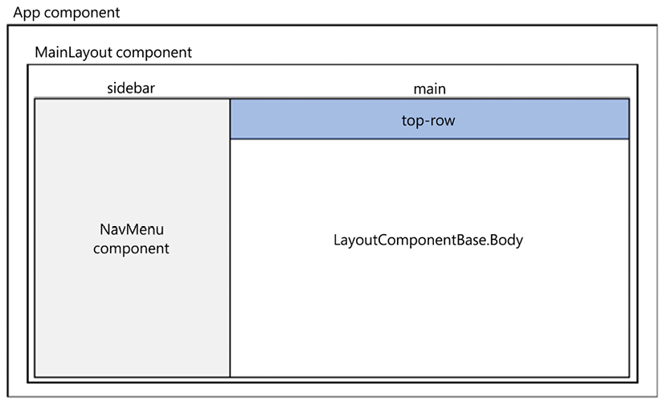

# Building Your First Blazor WebAssembly Application 构建您的第一个 Blazor WebAssembly 应用程序
Blazor WebAssembly 是一个组件驱动的框架。Razor 组件是 Blazor WebAssembly 应用程序的基本构建块。它们是使用 C#、HTML 和 Razor 语法组合实现的类。当 web 应用程序加载时，这些类将作为普通的.NET 程序集(DLL)下载到浏览器中。

## Parameters 参数
组件参数用于使组件动态化。参数是组件的公共属性，用 Parameter 属性或 CascadingParameter 属性修饰。参数可以是简单类型、复杂类型、函数、RenderFragments 或事件回调。
```razor
    <h1>Hello @Text!</h1>
    @code {
        [Parameter] public string? Text { get; set; }
    }
```

参数的 get 和 set 访问器不得包含自定义逻辑。它们仅用作允许信息从父级流向子级的通道。此外，如前所述，它们必须是public的。如果子组件包含导致父组件重新渲染的参数，应用程序将进入无限循环。

### Required parameters 必需的参数
可使用 EditorRequired 属性修饰来指定编辑器需要的参数。在以下版本的 Hello2 组件中， 不提供Text 参数，编译器会发出警告，但依然可以编译运行：
```razor
    <h1>Hello @Text!</h1>
    @code {
        [Parameter] 
        [EditorRequired]
        public string? Text { get; set; }
    }
```

### Query strings 查询字符串
组件也可以从查询字符串接收参数。查询字符串用于为指定的参数赋值。为了表明参数可以来自查询字符串，我们用SupplyParameterFromQuery属性装饰参数。
```razor
    @page "/Hello"
    <h3>Hello</h3>
    <p>@Text</p>

    @code {
        [Parameter, SupplyParameterFromQuery]
        public string Text { get; set; }
    }
```

这是将 Increment 的值设置为 5 的代码：https://localhost:7294/Hello?Text=HelloWorld

在上面的例子中，问号后面的内容都是查询字符串。查询字符串不区分大小写。另外，上面的例子假设我们正在本地端口 7294 上运行我们的应用程序。由于所使用的端口将根据应用程序而变化，因此我们将在其余的例子中排除端口。

## Component life cycle 组件生命周期
Razor 组件继承自 ComponentBase 类。 ComponentBase 类包括用于管理组件生命周期的异步和同步方法。在本书中，我们将使用这些方法的异步版本，因为它们执行时不会阻塞其他操作。这是组件生命周期中方法的调用顺序：
* SetParametersAsync:该方法设置呈现树中组件父组件提供的参数。
* OnInitializedAsync：在设置了参数并成功初始化组件之后调用此方法。
* OnParametersSetAsync：在组件初始化后以及每次组件重新渲染时调用此方法。当父组件重新渲染并且至少一个参数发生更改时，组件将重新渲染。此外，当调用组件的 StateHasChanged 方法时，组件将重新呈现。
* OnAfterRenderAsync：组件完成渲染后调用此方法。此方法适用于 JavaScript，因为 JavaScript 需要先呈现文档对象模型 (DOM) 元素，然后才能执行任何操作

## Routing 路由
URL 相对于 wwwroot/index.html 文件中指定的基本路径进行解析。使用以下语法在 head 元素中指定基本路径：
```razor
    <base href="/" />
```

与您可能使用过的其他框架不同，路由不是从其文件的位置推断出来的。例如，在 Demo 项目中， Counter 组件位于 /Pages/Counter 文件夹中，但它使用/counter路由。

## Route parameters 路由参数
路由参数可用于填充组件的参数。组件和路由参数必须具有相同的名称，但不区分大小写。
```razor
    @page "/Test/{text}"
    <h1>Blazor WebAssembly is @Text!</h1>
    @code {
        [Parameter] public string? Text { get; set; }
        protected override void OnInitialized() {
            Text = Text ?? "fantastic";
        }
    }
```
若此时不提供路由参数，例如访问http://localhost:5187/test，将无法路由到该组件。

## Optional route parameters 可选路由参数
在以下版本的Test组件中， Text 属性是可选的：
```razor
    ```razor
    @page "/Test/{text?}"
    <h1>Blazor WebAssembly is @Text!</h1>
    @code {
        [Parameter] public string? Text { get; set; }
        protected override void OnInitialized() {
            Text = Text ?? "fantastic";
        }
    }
```
若此时不提供路由参数，例如访问http://localhost:5187/test，将正常路由到该组件。

如果您需要组件使用不同的可选参数值导航到自身，则应在 OnParametersSet 事件而不是 OnInitialized 事件中设置该值。

## Catch-all route parameters 捕获所有路由参数
Catch-all的路由参数用于捕获跨多个文件夹边界的路径。此类路由参数是 string 类型，只能放在URL的末尾。Catch-all的路由参数用星号指定。
```razor
    @page "/Test/{*text}"
    <h1>Blazor WebAssembly is @Text!</h1>
    @code {
        [Parameter] public string? Text { get; set; }
        protected override void OnInitialized() {
            Text = Text ?? "fantastic";
        }
    }
```
对于 /Test/2/3/4/5 URL，前面的代码会将 Path 参数的值设置为 2/3/4/5

## Route constraints 路由约束
```razor
    @page "/counter/{increment:int}"
```
路由约束使用不变文化并且不支持本地化。例如，日期仅以 MM-dd-yyyy 或 yyyy-MM-dd 形式有效，并且布尔值必须为 true 或 false 。

## Getting started with the project 项目入门
创建一个"Blazor WebAssembly 应用”的项目。

Properties文件夹中的launchSettings.json 文件中的设置仅应用于您的本地开发计算机。

wwwroot 文件夹是应用程序的 Web 根目录。仅此文件夹中的文件可通过 Web 寻址。 wwwroot 文件夹包含级联样式表 (CSS)、示例数据文件、图标文件、字体和 index.html 的集合。在本书的后面，除了这些类型的文件之外，我们还将使用此文件夹来存储公共静态资源，例如图像和 JavaScript 文件。

index.html 文件是 Web 应用程序的根页面。每当最初请求页面时，都会呈现 index.html 页面的内容并在响应中返回。 index.html 文件的 head 元素包含指向 css 文件夹中每个 CSS 文件的链接，并指定用于 Web 应用程序的基本路径。 index.html 文件的 body 元素包括两个 div 元素和对 blazor.webassembly.js 文件的引用。
index.html中head部分代码如下：
```html
    <head>
        <meta charset="utf-8" />
        <meta name="viewport" content="width=device-width, initial-scale=1.0" />
        <title>BlazorWebAssembly</title>
        <base href="/" />
        <link rel="stylesheet" href="css/bootstrap/bootstrap.min.css" />
        <link rel="stylesheet" href="css/app.css" />
        <link rel="icon" type="image/png" href="favicon.png" />
        <link href="BlazorWebAssembly.styles.css" rel="stylesheet" />
    </head>
```

base 元素用于指示用 @path 指令表示的 URL 的基本路径。在我们的项目中， href 属性指向应用程序的根目录。 index.html 文件中需要 base 元素。

index.html 引用了三个不同的样式表：
* bootstrap.min.css：用于 Bootstrap 5.1 ，位于 / css/bootstrap 文件夹中。
* app.css：包括全局应用于项目的样式，位于/ css 文件夹中。
* BlazorWebAssembly.styles.css：将在组件级别定义的任何 CSS 文件捆绑到一个文件中。这样做是为了启用 CSS 隔离。捆绑的 CSS 文件是在构建时在 obj 文件夹中创建的。

项目的BlazorWebAssembly.styles.css副本位于 …\BlazorWebAssembly\obj\Debug\net8.0\scopedcss\bundle中。

index.html中body部分代码如下：
```html:
    <body>
        <div id="app">
            <svg class="loading-progress">
                <circle r="40%" cx="50%" cy="50%" />
                <circle r="40%" cx="50%" cy="50%" />
            </svg>
            <div class="loading-progress-text"></div>
        </div>

        <div id="blazor-error-ui">
            An unhandled error has occurred.
            <a href="" class="reload">Reload</a>
            <a class="dismiss">🗙</a>
        </div>
        <script src="_framework/blazor.webassembly.js"></script>
    </body>
```

如您所见，App 组件包含一个加载进度指示器，显示了加载百分比。由于项目非常简单，因此您在运行应用程序时可能没有注意到它，因为它加载得非常快。
可以删除加载进度指示器：
```razor
    <div id="app">
    </div>
```

此外，您还可以通过更新 \css\app.css 文件中的相关样式来自定义加载进度指示器的外观。

id为blazor-error-ui的div用于显示未处理的异常。此 div 元素的样式也在 \css\app.css 文件中。 

blazor.webassembly.js 文件是下载.NET运行时、应用程序的程序集、应用程序依赖项的脚本。它还初始化运行时以运行 Web 应用程序。

## The App component App组件
App 组件在 App.razor 文件中定义：
```razor
    <Router AppAssembly="@typeof(App).Assembly">
        <Found Context="routeData">
            <RouteView RouteData="@routeData" DefaultLayout="@typeof(MainLayout)" />
            <FocusOnNavigate RouteData="@routeData" Selector="h1" />
        </Found>
        <NotFound>
            <PageTitle>Not found</PageTitle>
            <LayoutView Layout="@typeof(MainLayout)">
                <p role="alert">Sorry, there's nothing at this address.</p>
            </LayoutView>
        </NotFound>
    </Router>
```

App 组件是 Blazor WebAssembly 应用程序的根组件。它使用 Router 组件来设置 Web 应用程序的路由。在前面的代码中，如果找到路由， RouteView 组件会接收 RouteData 并使用指示的 DefaultLayout 呈现指定组件。如果未找到路由，则使用 NotFound 模板，并使用指示的 Layout 呈现 LayoutView 。

如您所见，Found 模板和 NotFound 模板使用相同的布局，它们都使用 MainLayout 组件。但是，它们不需要使用相同的布局组件。我们将在本章后面讨论 MainLayout 组件。

Found 模板包含 FocusOnNavigate 组件。它需要两个属性：
* RouteData – 来自 Router 组件的路由数据
* Selector – 导航完成时应获得焦点的元素的 CSS 选择器

在前面的代码中，当路由器导航到新页面时，焦点将位于该页面上的第一个 h1 元素上。

## The Shared folder 共享文件夹
Shared 文件夹包含共享 Razor 组件，其中包括 MainLayout 组件。这些组件中的每一个都可以被其他 Razor 组件使用一次或多次。 Shared 文件夹中的所有组件都不包含 @page 指令，因为它们不可路由。

## The Pages folder Pages文件夹
Pages 文件夹包含项目使用的可路由 Razor 组件。可路由组件是 Counter 、 Weather 和 Home 。每个组件都包含一个 @page 指令，用于将用户路由到页面。

## The Client folder Client文件夹
Client 文件夹包含 Program.cs 文件。Program.cs 文件是应用程序的入口点。它包含名为 Main 的方法：
```razor
    public static async Task Main(string[] args) {
        var builder = WebAssemblyHostBuilder.CreateDefault(args);
        builder.RootComponents.Add<App>("#app");
        builder.RootComponents.Add<HeadOutlet>("head::after");

        builder.Services.AddScoped(sp => new HttpClient { BaseAddress = new Uri(builder.HostEnvironment.BaseAddress) });

        await builder.Build().RunAsync();        
    }
```

在前面的方法中，构建并运行了 WebAssemblyHost 。作为该过程的一部分， App 组件被定义为 RootComponent 并被放置到 wwwroot/index.html 文件的 app 对象中。此外， HttpClient 基地址是 HttpClient 在依赖注入服务中注册时配置的。可以使用 @inject 指令将注册的服务注入到组件中。


## The _Imports.razor file _Imports.razor 文件
_Imports.razor 文件包含由多个 Razor 组件共享的常见 Razor 指令。通过将它们包含在此文件中，它们不需要包含在各个组件中。一个项目可以包含多个 _Imports.razor 文件，每一个都应用于其当前文件夹和子文件夹。

_Imports.razor 文件中的任何 @using 指令仅应用于 Razor (RAZOR) 文件。它们不适用于 C# (CS) 文件。当使用我们将在本章后面讨论的代码隐藏技术时，这种区别很重要。

## Examining the shared Razor components 检查共享 Razor 组件
共享 Razor 组件位于 Shared 文件夹中，项目中有三个共享的 Razor 组件：
* MainLayout 组件
* NavMenu 组件
* SurveyPrompt 组件

### The MainLayout component MainLayout组件
MainLayout 组件用于定义项目的页面布局：
MainLayout.razor：
```razor
    @inherits LayoutComponentBase
    <div class="page">
        <div class="sidebar">
            <NavMenu />
        </div>

        <main>
            <div class="top-row px-4">
                <a href="https://learn.microsoft.com/aspnet/core/" target="_blank">About</a>
            </div>

            <article class="content px-4">
                @Body
            </article>
        </main>
    </div>
```

MainLayout 组件继承自 LayoutComponentBase 类。 LayoutComponentBase 类表示一种布局，并且只有一个属性，即 Body 属性。 Body 属性获取要在布局内呈现的内容。
项目的 MainLayout 组件定义的页面布局：


Blazor WebAssembly App  项目模板使用 Bootstrap 5.1 来设置其页面的样式。如果您不熟悉 Bootstrap 5.1，可以参考 https://getbootstrap.com/docs/5.1/getting-started/introduction/ 熟悉其语法。遗憾的是，微软提供的项目模板并没有使用最新版本的Bootstrap。

MainLayout 组件包含在 MainLayout.razor.css 文件中定义的其自己的专用 CSS 样式。这是 CSS 隔离的一个例子。通过使用 CSS 隔离，我们可以减少全局样式的数量并避免嵌套内容中的样式冲突。正如我们之前提到的，在构建过程中，所有组件级样式都将捆绑在一起到一个 CSS 文件中。

### The NavMenu component 导航菜单组件
NavMenu 组件定义项目的导航菜单。它使用多个 NavLink 组件来定义各种菜单选项。这是 NavMenu 组件的部分，它引用用于项目导航的 NavLink 组件：
```razor
    <div class="@NavMenuCssClass nav-scrollable" @onclick="ToggleNavMenu">
        <nav class="flex-column">
            <div class="nav-item px-3">
                <NavLink class="nav-link" href="" Match="NavLinkMatch.All">
                    <span class="bi bi-house-door-fill-nav-menu" aria-hidden="true"></span> Home
                </NavLink>
            </div>
            <div class="nav-item px-3">
                <NavLink class="nav-link" href="counter">
                    <span class="bi bi-plus-square-fill-nav-menu" aria-hidden="true"></span> Counter
                </NavLink>
            </div>
            <div class="nav-item px-3">
                <NavLink class="nav-link" href="weather">
                    <span class="bi bi-list-nested-nav-menu" aria-hidden="true"></span> Weather
                </NavLink>
            </div>
        </nav>
    </div>
```

NavLink 组件在 Microsoft.AspNetCore.Components.Routing 命名空间中定义。它的行为类似于 a 元素，只不过它添加了突出显示当前 URL 的功能。这是当选择 Counter 组件时由 NavLink 为 Counter 组件呈现的 HTML：
```razor
    <a href="counter" class="nav-link active">
        <span class="oi oi-plus" aria-hidden="true"></span>
        Counter
    </a>
```

NavMenu 组件包含在 NavMenu.razor.css 文件中定义的其自己的专用 CSS 样式。这是 CSS 隔离的另一个例子。

### The SurveyPrompt component SurveyPrompt 组件
SurveyPrompt 组件创建一个指向 Blazor 简短调查的链接。

## Examining the routable Razor components 检查可路由的 Razor 组件
可路由的 Razor 组件位于 Pages 文件夹中。可路由的 Razor 组件在文件顶部包含一个或多个 @page 指令。 项目中有三个可路由的 Razor 组件：
* Home 组件
* Counter 组件
* Weather 组件

### The Home component Home组件
项目的 Home 页面使用 Pages/Home.razor 文件中定义的 Home 组件：
```razor
    @page "/"
    <PageTitle>Home</PageTitle>
    Welcome to your new app.
    <SurveyPrompt Title="How is Blazor working for you?" />
```

代码包含一个 @page 指令，该指令引用 Web 应用程序的根目录和一些标记。标记包括 PageTitle 组件和 SurveyPrompt 组件。

PageTitle 组件是一个内置的 Razor 组件，用于呈现 HTML title 元素。 title 元素用于定义浏览器中页面的标题，是浏览器选项卡上显示的文本。当页面添加到收藏夹时也会使用它。

如果您的组件包含多个 PageTitle 组件，则仅使用最后一个要渲染的组件。其他的将被忽略。

### The Counter component Counter组件
它包含一个用于路由和一些标记的 @page 指令。但是，它还包含一个 C# 代码块：
```razor
    @page "/counter"
    <PageTitle>Counter</PageTitle>
    <h1>Counter</h1>
    <p role="status">Current count: @currentCount</p>
    <button class="btn btn-primary" @onclick="IncrementCount">Click me</button>

    @code {
        private int currentCount = 0;
        private void IncrementCount() {
            currentCount++;
        }
    }
```

IncrementCount 方法增加 currentCount 变量的值， Counter组件重新生成其渲染树。 Blazor 将新的渲染树与前一个渲染树进行比较，并将所有修改应用到浏览器的 DOM，这会导致显示的计数被更新。

### The Weather component Weather组件
开头部分如下：
```razor
    @page "/weather"
    @inject HttpClient Http
```

@page 指令用于路由， @inject 指令用于依赖注入。在此组件中， Program.cs 文件中定义的 HttpClient 被注入到视图中。

继续阅读代码：
```razor
    <PageTitle>Weather</PageTitle>
    <h1>Weather</h1>
    <p>This component demonstrates fetching data from the server.</p>
    @if (forecasts == null) {
        <p><em>Loading...</em></p>
    }
    else {
        <table class="table">
            <thead>
                <tr>
                    <th>Date</th>
                    <th>Temp. (C)</th>
                    <th>Temp. (F)</th>
                    <th>Summary</th>
                </tr>
            </thead>
            <tbody>
                @foreach (var forecast in forecasts) {
                    <tr>
                        <td>@forecast.Date.ToShortDateString()</td>
                        <td>@forecast.TemperatureC</td>
                        <td>@forecast.TemperatureF</td>
                        <td>@forecast.Summary</td>
                    </tr>
                }
            </tbody>
        </table>
    }
```

以上标记演示了开发 Blazor WebAssembly 应用程序时经常使用的非常重要的模式的用法。由于应用程序在浏览器上运行，因此所有数据访问都必须是异步的。这意味着当页面首次加载时，数据将为 null 。因此，在尝试处理数据之前，您始终需要测试 null 情况。

第一次呈现页面时， forecasts 的值将为 null 。当 forecasts 的值为 null 时，如果不进行处理，框架会抛出异常。

继续阅读代码：
```razor
    @code {
        private WeatherForecast[]? forecasts;

        protected override async Task OnInitializedAsync() {
            forecasts = await Http.GetFromJsonAsync<WeatherForecast[]>("sample-data/weather.json");
        }

        public class WeatherForecast {
            public DateOnly Date { get; set; }

            public int TemperatureC { get; set; }

            public string? Summary { get; set; }

            public int TemperatureF => 32 + (int)(TemperatureC / 0.5556);
        }
    }
```
Blazor 组件具有明确定义的生命周期。渲染组件时会调用 OnInitializedAsync 方法。 OnInitializedAsync 方法完成后，组件将重新呈现。

## Using a component 使用组件
Razor 组件的使用方式是将它们包含在另一个组件的标记中。

下面我们新增一个@page "/counter/{MyNum:int}"，并修改了@code部分的代码，使其每次新增都加上MyNum：
```razor
    @page "/counter"
    @page "/counter/{MyNum:int}"
    <PageTitle>Counter</PageTitle>
    <h1>Counter</h1>
    <p role="status">Current count: @currentCount</p>
    <button class="btn btn-primary" @onclick="IncrementCount">Click me</button>

    @code {
        [Parameter]
        [SupplyParameterFromQuery]
        public int MyNum { get; set; }
        private int currentCount = 0;

        private void IncrementCount() {
            currentCount += MyNum;
        }
    }
```

访问https://localhost:7005/counter/10 后单击按钮，可发现每次新增10。
访问https://localhost:7005/counter/10a 后单击按钮，由于10a不是一个有效的int，因此页面被定向到 App 组件中定义的 NotFound 内容，如下图所示。


如果您需要导航到代码中的 URL，则应使用 NavigationManager 。 NavigationManager 提供了 NavigateTo 方法，用于将用户导航到指定的 URI，而不强制加载页面。


# Debugging and Deploying a Blazor WebAssembly App 调试和部署 Blazor WebAssembly 应用程序
调试 Blazor WebAssembly 应用程序时，Microsoft Visual Studio 提供了我们所需的大部分功能。然而，由于使用 Blazor WebAssembly 构建的应用程序运行在客户端，因此我们还需要学习如何使用浏览器的开发者工具（DevTools）来调试应用程序。调试完 Blazor WebAssembly 应用程序后，我们可以使用 Microsoft Visual Studio 来部署它。

## Debugging in the browser 在浏览器中调试
在浏览器上调试 Blazor WebAssembly 应用程序需要执行几个步骤。
1. 按Ctrl F5启动应用程序，无需调试。
2. 按 Shift+Alt+D 开始调试。
3. 按页面提示启用远程调试功能。此过程将启动另一个启用了调试的浏览器窗口。如果系统要求您同步设备，您可以选择“否”。
4. 按 Shift+Alt+D 开始调试，这次成功，而不会有失败提示了。

现在浏览器中打开了2个选项卡。第1个选项卡正在运行应用程序，第2个选项卡正在运行 DevTools。在第2个选项卡中切换到“源代码”并设置需要的断点，开始调试即可。

## Understanding logging 理解日志记录
日志记录是任何应用程序故障排除的基本工具。它有助于识别和解决问题。在微软提供的 Blazor WebAssembly 项目模板中，默认启用了日志记录。然而，唯一启用的日志记录提供程序是 Console 提供程序。Console 提供程序不存储日志，它只显示它们。如果您需要保留日志，您将需要使用不同的提供程序。
修改Counter.razor代码：
```razor
    @page "/counter"
    @page "/counter/{MyNum:int}"
    @inject ILogger<Counter> Logger
    <PageTitle>Counter</PageTitle>
    <h1>Counter</h1>
    <p role="status">Current count: @currentCount</p>
    <button class="btn btn-primary" @onclick="IncrementCount">Click me</button>

    @code {
        [Parameter]
        [SupplyParameterFromQuery]
        public int MyNum { get; set; }
        private int currentCount = 0;

        private void IncrementCount() {
            Logger.LogInformation("Btn Clicked!");
            currentCount += MyNum;
        }
    }
```

我们将 ILogger<Counter> 对象注入到页面中。它使用类类型的完全限定名称作为日志类别。日志类别包含在该 ILogger 实例创建的每条日志消息中。我们还调用 LogInformation 以在 Information 日志级别记录指示的字符串。

每次单击按钮时都会写入日志，在DevTools中控制台选项卡显示了单击按钮的结果：
```
    info: BlazorWebAssembly.Pages.Counter[0]
        Btn Clicked!
```

您应该使用 ILogger 而不是 System.Console.WriteLine 或 System.Diagnostics.Debug.WriteLine ，因为这些方法只允许您将文本发送到控制台，并且不包含该类的名称消息的始发者。

## Understanding log levels 理解日志级别
每当我们将一个项目记录到记录器时，我们必须提供日志级别。日志级别指示消息的严重性。

当使用日志记录时，尝试使用适当的日志级别，并尝试使您的消息尽可能短，而不会使它们变得毫无意义。使用一致的消息格式，以便它们可以很容易地过滤。最后，避免记录冗余或不相关的信息，因为日志记录不是免费的；它会消耗一些资源。

以下演示了如何使用各个日志级别：
```razor
    private void IncrementCount() {
        Logger.LogTrace("Logger: Trace");
        Logger.LogDebug("Logger: Debug");
        Logger.LogInformation("Logger: Information");
        Logger.LogWarning("Logger: Warning");
        Logger.LogError("Logger: Error");
        Logger.LogCritical("Logger: Critical");
        Logger.Log(LogLevel.None, "Logger: None");

        currentCount += MyNum;
    }
```

## Setting the minimum log level 设置最低日志级别
默认情况下，项目配置为显示最低日志级别为 Information 的所有记录项目。您可以通过完成以下步骤来调整此设置：
TODO:未看

## Handling exceptions 处理异常
作为模板的一部分，当 Blazor WebAssembly 应用程序中发生未处理的异常时，屏幕底部会显示一个黄色条。


您可以通过修改 index.html 文件来修改显示的错误消息的文本和样式。黄色条的 UI 在 wwwroot/index.html 文件中定义：
```razor
    <div id="blazor-error-ui">
        An unhandled error has occurred.
        <a href="" class="reload">Reload</a>
        <a class="dismiss">🗙</a>
    </div>
```

还可以修改 wwwroot/css/app.css 文件中显示的错误消息的样式。

### Setting error boundaries 设置错误边界
错误边界可用于处理异常。 ErrorBoundary 组件是一个内置组件，用于在 UI 级别处理未处理的错误。它包括一个在未发生错误时呈现的 ChildContent 属性和一个在发生错误时呈现的 ErrorContent 属性。 ErrorBoundary 组件可以包裹在任何其他组件周围。
我们创建一个ThrowException组件：
```razor
    <button class="btn btn-primary" @onclick="NewException">
        Throw Exception
    </button>
    @code {
        private void NewException() {
            throw new Exception("This is a sample error!");
        }
    }
```

在Home组件中，将 ErrorBoundary 组件包装在 ThrowException 周围：
```razor
    <ErrorBoundary>
        <ChildContent>
            <ThrowException />
        </ChildContent>
    </ErrorBoundary>
```

ErrorBoundary 组件的默认 UI 在 wwwroot/css/app.css 文件中定义。默认消息非常通用，我们可以使用 ErrorBoundary 组件的 ErrorContent 属性添加自己的自定义错误消息。这是更新后的 ErrorBoundary 组件，其中包含 ErrorContent 属性：
```razor
    <ErrorBoundary>
        <ChildContent>
            <ThrowException />
        </ChildContent>
        <ErrorContent>
            <h3>The Throw Exception button caused this error!</h3>
        </ErrorContent>
    </ErrorBoundary>
```

ErrorBoundary 组件仅处理 UI 级别的错误。它允许开发人员在 UI 中的单个点捕获错误。为了以编程方式处理错误，我们需要创建一个自定义错误组件。

### Creating a custom error component 创建自定义错误组件
自定义错误组件可以传递给每个子组件。当遇到错误时，以下 ErrorHandler 组件将写入日志
```razor
    @inject ILogger<ErrorHandler> Logger
    <CascadingValue Value="this">
        @ChildContent
    </CascadingValue>
    @code {
        [Parameter]
        public RenderFragment? ChildContent { get; set; }
        public void ProcessError(Exception ex)
        {
            Logger.LogError("Message: {Message}", ex.Message);
        }
    }
```

ErrorHandler 需要作为 CascadingParameter 添加到将使用它的组件中。这是 ThrownExceptionHandled 组件：
```razor
    <button class="btn btn-primary" @onclick="NewException">
        Throw Exception
    </button>
    @code {
        [CascadingParameter]
        public ErrorHandler? Error { get; set; }
        private void NewException()
        {
            try
            {
                throw new Exception("This is a sample error!");
            }
            catch (Exception ex)
            {
                Error?.ProcessError(ex);
            }     
        }
    }
```

在Home组件中使用：
```razor
    <ErrorHandler>
        <ThrownExceptionHandled></ThrownExceptionHandled>
    </ErrorHandler>
```

浏览器调试窗口的Console显示如下：
```
    fail: BlazorWebAssembly.Pages.ErrorHandler[0]
        Message: This is a sample error!
```

当遇到未处理的异常时，Microsoft 提供的 Blazor WebAssembly 项目模板会在页面底部呈现一个通用黄色条。我们可以使用 ErrorBoundary 组件来自定义 UI。更好的是，我们可以创建自定义错误组件，以更好地控制错误的处理方式。

# Building a Modal Dialog Using Templated Components 使用模板组件构建模态对话框
模态对话框是出现在窗口中所有其他内容之上的对话框，需要用户交互才能将其关闭。模板组件是一种接受一个或多个 UI 模板作为参数的组件。模板组件的 UI 模板可以包含任何 Razor 标记。

在本章中，我们将学习 RenderFragment 参数、EventCallback 参数、 CSS 隔离。当父组件需要与子组件共享信息时，使用 RenderFragment 参数；反之，当子组件需要与父组件共享信息时，使用 EventCallback 参数。 CSS 隔离用于将 CSS 样式限制在特定组件范围内。

在本章中，我们将创建一个模态对话框组件。该组件将是一个模板组件，可以根据其参数呈现不同的HTML。它将使用事件回调将事件返回给调用组件。它将使用CSS隔离添加格式，使其表现得像一个模态对话框。我们将通过将模态对话框组件添加到另一个组件来测试它。最后，我们将将该组件移动到Razor类库中，以便它可以轻松地与其他项目共享。

## Using RenderFragment parameters 使用RenderFragment参数
RenderFragment 参数是一段 UI 内容。它用于将 UI 内容从父级传递给子级。 UI 内容可以包括纯文本、HTML 标记、Razor 标记或其他组件。
现有Alert.razor代码如下：
```razor
    <h3>Alert</h3>
    @if (Show) {
        <div>
            <div>
                <div>@ChildContent</div>
                <div>
                    <button @onclick="OnOk">OK</button>
                </div>
            </div>
        </div>
    }
    @code {
        [Parameter] public bool Show { get; set; }
        [Parameter] public EventCallback OnOk { get; set; }
        [Parameter] public RenderFragment ChildContent { get; set; }
    }
```

Home.razor代码如下：
```razor
    @page "/"

    <PageTitle>Home</PageTitle>
    <h1>Hello, world!</h1>
    Welcome to your new app.

    <Alert Show="showAlert" OnOk="()=>showAlert=false">
        <ChildContent>
            <h1>Alert</h1>
            <p>@DateTime.Now</p>
        </ChildContent>
    </Alert>

    @if (!showAlert) {
        <button @onclick="()=>showAlert=!showAlert">Show Alert</button>
        <button @onclick="Foo">Show Alert</button>
    }

    @code {
        private bool showAlert = false;
        private async Task Foo(){
            await Task.Delay(1000);
            showAlert = true;
        }
    }
```

点击button按钮时会显示Alert，点击Alert中的按钮时，Alter消失。

由于RenderFragment参数的名称是ChildContent，因此无需显式指定ChildContent参数，直接这样写即可：
```razor
    <Alert Show="showAlert" OnOk="()=>showAlert=false">
        <h1>Alert</h1>
        <p>@DateTime.Now</p>
    </Alert>
```

如果RenderFragment参数的名称不是约定的ChildContent，则需要显示指定参数名称，就像一开始的写法那样。

通过在标记中显式指定每个参数的名称，可以在组件中包含多个 RenderFragment 参数。

RenderFragment 参数使父组件能够传递其子组件要使用的 UI 内容，而 EventCallback 参数用于从子组件返回到父组件。

## Using EventCallback parameters 使用EventCallback参数
事件回调是当特定事件发生时传递给另一个方法的方法。例如，当单击 Alert 组件上的按钮时， @onclick 事件使用 OnOk 参数来确定应调用的方法。 OnOK 参数引用的方法是在父组件中定义的。

EventCallback 参数用于从子组件向父组件共享信息，并在发生某些情况（例如单击按钮）时通知父组件。父组件只是指定事件触发时调用的方法。

这是 EventCallback 参数的示例：
```csharp
    [Parameter] public EventCallback OnOk { get; set; }
```

以下示例对 OnOk 方法使用 lambda 表达式。当调用 OnOk 方法时， showAlert 属性的值设置为 false ：
```razor
    <Alert Show="showAlert" OnOk="@(() => showAlert = false)">
        <h1>Alert</h1>
        <p>Today is @DateTime.Now.DayOfWeek.</p>
    </Alert>

    @code {
        private bool showAlert = false;
    }
```

lambda 表达式用于创建匿名函数。但是，我们在使用 EventCallback 参数时不需要使用匿名函数，可以使用方法：
```razor
    <Alert Show="showAlert" OnOk="OkClickHandler">
        <h1>Alert</h1>
        <p>Today is @DateTime.Now.DayOfWeek.</p>
    </Alert>
    @code {
        private bool showAlert = false;
        private void OkClickHandler()
        {
            showAlert = false;
        }
    }
```

编写 Alert 组件时，您可能会想直接从组件上的 OnOk 事件更新 Show 参数。您不能这样做，因为如果您直接在组件中更新值并且需要重新渲染组件，则任何状态更改都将丢失。如果需要维护组件中的状态，则应该向组件添加私有字段。

Components should never write to their own parameters.
组件永远不应该写入自己的参数。

Alert 组件在页面上显示文本，但它还不能像模态对话框那样工作。为了使其像模式对话框一样工作，我们需要更新组件使用的样式表。我们可以通过使用 CSS 隔离来做到这一点。在下一节中，我们将解释如何使用 CSS 隔离。

## Understanding CSS isolation 理解 CSS 隔离
用于设计 Blazor WebAssembly 应用程序样式的级联样式表 (CSS) 的位置通常是 wwwroot 文件夹。通常，这些 CSS 文件中定义的样式会应用于 Web 应用程序中的所有组件。然而，有时我们希望对应用于特定组件的样式有更多的控制。为了实现这一点，我们使用 CSS 隔离。通过 CSS 隔离，指定 CSS 文件中的样式将覆盖全局样式，并且仅针对特定组件及其子组件。

### Enabling CSS isolation 启用 CSS 隔离
要添加作用域为特定组件的 CSS 文件，请在与该组件相同的文件夹中创建一个与该组件同名但具有 CSS 文件扩展名的 CSS 文件。例如， Alert.razor 组件的 CSS 文件将被称为 Alert.razor.css 。
在Alert.razor文件中设置class：
```razor
    @if (Show) {
        <div class="dialog-container">
            <div class="dialog">
                <div>@ChildContent</div>
                <div>
                    <button @onclick="OnOk">OK</button>
                </div>
            </div>
        </div>
    }
```

Alert.razor.css：
```razor
    .dialog-container {
        position: absolute;
        top: 0;
        bottom: 0;
        left: 0;
        right: 0;
        background-color: rgba(0,0,0,0.6);    
        z-index: 2000;
    }

    .dialog{
        background-color:green;
        margin:auto;
        width:15rem;
        padding: .5rem;
    }
```

为了使项目能够使用 CSS，我们需要添加一个指向 wwwroot/index.html 文件的链接。按照约定，需要链接的 CSS 文件的名称是程序集的名称，后跟 .styles.css 。例如，如果项目名称为 BlazorWebAssembly ，则需要将指向 BlazorWebAssembly.styles.css 的链接添加到 wwwroot/index.html 文件中。幸运的是，index.html文件中已经帮我们写好了代码，我们无需自己添加：
```html
    <link href="BlazorWebAssembly.styles.css" rel="stylesheet" />
```

BlazorWebAssembly.style.css 文件是在构建时创建的。创建后，Blazor 引擎会通过附加框架生成的每个组件唯一的字符串来重写每个组件的 CSS 和 HTML。重写的CSS样式被捆绑到一个文件中并保存为静态资源。
在浏览器按F12，可见代码如下：
```html
    <div class="dialog-container" b-z6m7jjosxd="">
        <div class="dialog" b-z6m7jjosxd="">
            <div b-z6m7jjosxd="">
                <h1>Alert</h1>
                <p>2024/4/4 上午9:53:52</p>
            </div>
            <div b-z6m7jjosxd="">
                <button b-z6m7jjosxd="">OK</button>
            </div>
        </div>
    </div>
```

```css    
    .dialog-container[b-z6m7jjosxd] {
        position: absolute;
        top: 0;
        bottom: 0;
        left: 0;
        right: 0;
        background-color: rgba(0,0,0,0.6);    
        z-index: 2000;
    }

    .dialog[b-z6m7jjosxd]{
        background-color:green;
        margin:auto;
        width:15rem;
        padding: .5rem;
    }   
```

按照约定， BlazorWebAssembly.styles.css 文件的内容位于 obj/{CONFIGURATION}/{TARGET FRAMEWORK}/scopedcss/projectbundle/{ASSEMBLY NAME}.bundle.scp.css 文件中。在前面的示例中，文件位于 \BlazorWebAssembly\obj\Debug\net8.0\scopedcss\bundle 文件夹中

### Supporting child components 支持子组件
默认情况下，使用 CSS 隔离时，CSS 样式仅应用于当前组件。如果我们希望 CSS 样式应用于当前组件的子组件，则需要在样式中使用 ::deep 伪元素。此伪元素选取标识符元素的所有后代元素。

例如，以下样式将应用于当前组件内的任何 h1 标题，以及当前组件子组件内的任何 h1 标题：
```css
    ::deep h1 {
        color: red;
    }
```

如果您不希望组件使用全局样式或希望通过 Razor 类库共享组件，则 CSS 隔离非常有用。

作用域 CSS 不适用于 Razor 组件。它仅适用于 Razor 组件呈现的 HTML 元素。

## Creating the modal dialog project 创建模态对话框项目
TODO：未看

# Building a Local Storage Service Using JavaScript Interoperability (JS Interop) 使用 JavaScript 互操作性构建本地存储服务
Blazor WebAssembly 框架使我们能够在浏览器上运行 C# 代码。然而，有些场景 C# 根本无法处理，对于这些场景，我们需要使用 JavaScript 函数。

# Building a Shopping Cart Using Application State 使用应用程序状态构建购物车
有时，我们需要应用程序在不同页面之间维护其状态。我们可以通过使用依赖注入（DI）来实现这一点。 DI 用于访问在中央位置配置的服务。


