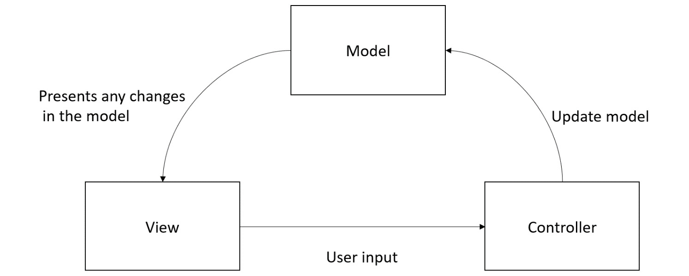
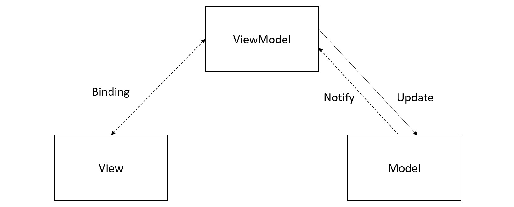
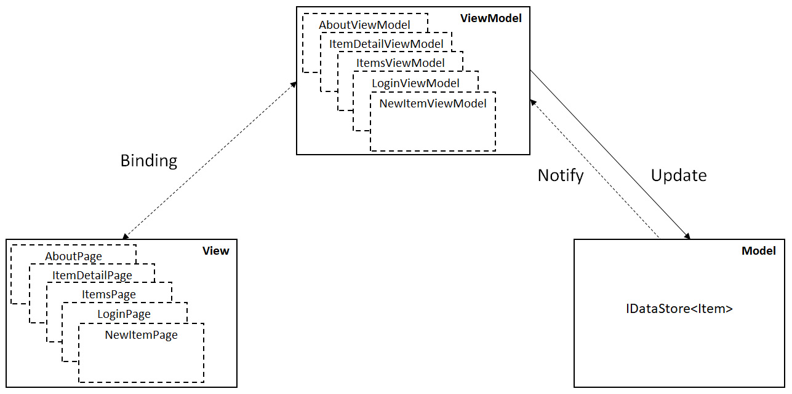
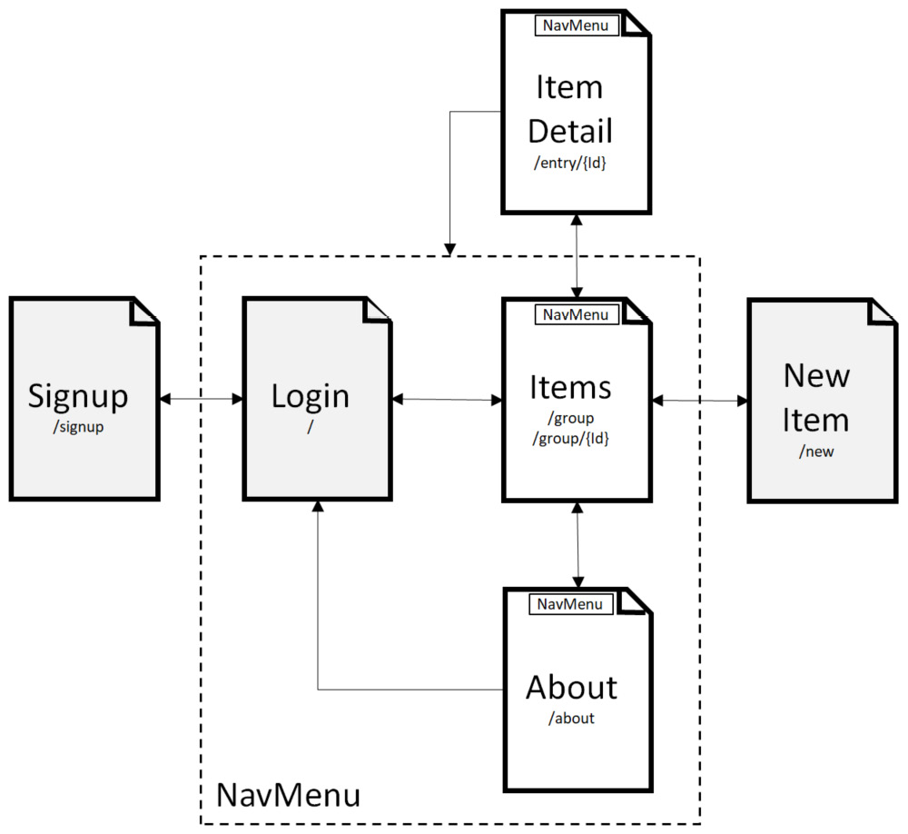
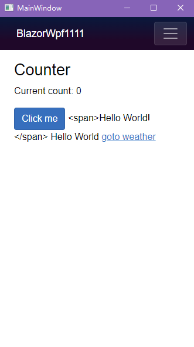
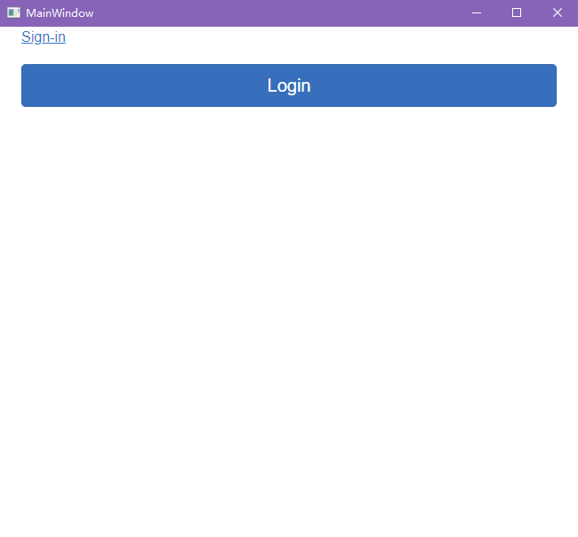
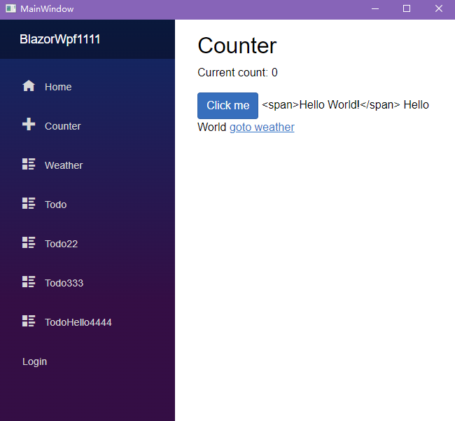
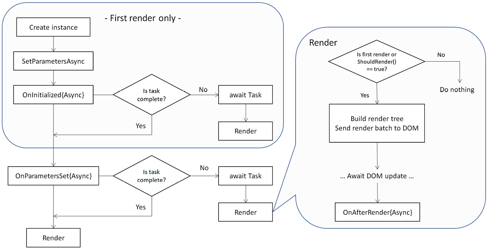

# 第一部分介绍MAUI
# User Interface Design with XAML 使用XAML设计用户界面
视图(View)是用户界面设计中用于呈现、编辑或启动命令的UI对象。

## Controls in .NET MAUI .NET MAUI中的控件
简单示例：
```xml
    <Editor
    Placeholder="Enter here"/>

    <Entry
        Placeholder="Enter here"
        PlaceholderColor="Red"
        Keyboard="Text"
        IsPassword="True"
        />
```

# Exploring MVVM and Data Binding 探索MVVM和数据绑定
## Understanding MVVM and MVC 理解MVVM和MVC
在软件设计中，我们通常遵循和重用好的实践和设计模式。模型-视图-控制器(MVC)模式是一种解耦系统责任的方法。它可以帮助将UI的实现和业务逻辑分离到不同的部分。


如图所示，MVC模式将系统的职责划分为3个不同的部分:

> Model存储应用数据并处理业务逻辑。Model类通常可以实现为普通旧CLR对象(Plain Old CLR Objects, POCOs)或数据传输对象(Data Transfer Objects, DTOs)。POCO是一个不依赖于任何框架特定类的类，因此POCO类可以与LINQ或实体框架很好地使用。DTO是POCO类的子集，只包含没有逻辑或行为的数据。DTO类可以用于在层之间传递数据。Model不依赖于View或Controller ，因此它可以单独实现和测试。

> View将Model信息呈现给用户，并与用户交互。

> Controller根据用户的操作更新Model和View，我们对Model和View的理解并没有随着时间的推移而改变太多，但自从引入MVC模式以来，对Controller的理解和实现已经有了不同的变化。

模型-视图-表示器(Model-View-Presenter, MVP)就是其中之一，后来微软在WPF中使用了MVVM和XAML，也就是MVP的一个变体，在Xamarin.Forms和.NET MAUI中也使用了XAML和MVVM模式。


如图所示，在MVVM中，ViewModel代替了Controller，MVVM和MVC的区别如下：
> View和Model的解耦：ViewModel用于处理View和Model之间的通信。View通过ViewModel访问Model中的数据和逻辑。
> View和ViewModel之间的数据绑定：使用数据绑定，对View或ViewModel的更改可以自动更新在另一个中，这可以帮助降低实现的复杂性。
> 在MVC和MVVM中，Model都可以单独测试，在MVVM中，也可以为ViewModel设计单元测试。

当View发生变化时，这些变化将通过数据绑定反映在ViewModel中，ViewModel将处理Model中的数据变化。同样，当Model中的数据发生变化时，ViewModel将被通知更新View。通知的常见解决方案是安装事件处理程序来通知变化。通过数据绑定，实现得到了显著简化。

## MVVM in PassXYZ.Vault PassXYZ.Vault中的MVVM
在我们的应用PassXYZ.Vault中，我们使用MVVM来处理View和ViewModel之间的数据交换，如图4-3所示，我们有5个XAML内容页和相同数量的ViewModel，在我们的数据模型中，我们有一个Item类，这是我们的Model类，它可以通过IDataStore接口访问。



数据绑定被用作View和ViewModel之间的通信通道。ViewModel通过IDataStore服务接口更新Item模型。我们将在下一节中通过分析项目详细页面和视图模型来学习如何使用数据绑定。

## Data binding 数据绑定


# Navigation using .NET MAUI Shell and NavigationPage 使用.NET MAUI Shell和NavigationPage进行导航


# 第二部分介绍Blazor
书上使用blazor maui介绍，这里笔记用blazor wpf。
# Introducing Blazor Hybrid App Development
Blazor的构件块是Razor组件。

## What is Blazor?
人们可能会分不清Blazor和Razor。Razor语法是一种标记语法，开发人员可以在HTML页面中嵌入C#代码。Blazor是一个SPA框架，它使用Razor语法作为编程语言。Blazor是一个基于组件的框架，而且一个Blazor应用程序由Razor组件组成。换句话说，Blazor是Razor组件的宿主模型。Blazor组件和Razor组件被广泛地交换使用，但是正确的术语是Razor组件。

一个Razor组件驻留在一个文件中，该文件具有.razor扩展，并在运行时将其编译为.NET类。这个.razor文件也可以分成两个文件:
* .razor
* .razor.cs
这种思想与XAML和代码隐藏非常相似。在本章中，我们将学习如何使用Razor语法构建Razor组件。

## Exploring Blazor Hybrid
在一个混合应用程序中，我们可以使用BlazorWebView控件在嵌入式WebView中构建和运行Razor组件。BlazorWebView控件可在.NET MAUI和Windows桌面环境中使用。我们可以在.NET MAUI、WPF或Windows Forms中构建Blazor混合应用程序。

## Running the new project
* wwwroot: 此文件夹是网页静态文件的根目录
* Pages: 此文件夹包含应用程序中的Razor页面
* Shared: 此文件夹包含可共享的Razor组件
* Main.razor: 这是Blazor应用程序的主页
* _Imports.razor: 这是在文件夹或项目级别导入Razor组件的帮助器

Startup.cs：
```csharp
    namespace BlazorWpf1 {
        public static class Startup {
            public static IServiceProvider? Services { get; private set; }

            public static void Init() {
                var host = Host.CreateDefaultBuilder()
                            .ConfigureServices(WireupServices)
                            .Build();
                Services = host.Services;
            }

            private static void WireupServices(IServiceCollection services) {
                services.AddWpfBlazorWebView();
                services.AddSingleton<WeatherForecastService>();

    #if DEBUG
                services.AddBlazorWebViewDeveloperTools();
    #endif
            }
        }
    }
```

MainWindow.xaml：
```xml
    <Window
        x:Class="BlazorWpf1.MainWindow"
        xmlns="http://schemas.microsoft.com/winfx/2006/xaml/presentation"
        xmlns:x="http://schemas.microsoft.com/winfx/2006/xaml"
        xmlns:b="clr-namespace:Microsoft.AspNetCore.Components.WebView.Wpf;assembly=Microsoft.AspNetCore.Components.WebView.Wpf"
        xmlns:d="http://schemas.microsoft.com/expression/blend/2008"
        xmlns:local="clr-namespace:BlazorWpf1"
        xmlns:mc="http://schemas.openxmlformats.org/markup-compatibility/2006"
        Title="MainWindow"
        Height="600"
        Width="800"
        mc:Ignorable="d">
        <Grid>
            <b:BlazorWebView
                HostPage="wwwroot/index.html"
                Services="{StaticResource services}"
                StartPath="/counter">
                <b:BlazorWebView.RootComponents>
                    <b:RootComponent
                        ComponentType="{x:Type local:Main}"
                        Selector="#app"/>
                </b:BlazorWebView.RootComponents>
            </b:BlazorWebView>
        </Grid>
    </Window>
```

在BlazorWebView中，我们可以使用HostPage属性和RootComponent嵌套组件来自定义BlazorWebView。

我们可以把BlazorWebView当作一个浏览器。HostPage属性用于指定要加载到Web视图控件中的静态HTML页面。在我们的示例中，它是wwwroot/index.html。在这个静态HTML文件中，我们需要指定Razor组件应该放置在哪里，以及哪个Razor组件应该是根组件。我们可以使用嵌套的RootComponent组件来指定这两者。BlazorWebView和RootComponent都是C#类。

在RootComponent中，我们使用Selector属性来定义一个CSS选择器，指定应用程序中的根Razor组件应该放在哪里。在我们的例子中，它是在index.html中定义的#app CSS选择器。ComponententType属性定义根组件的类型。在我们的例子中，它是Main。

index.html：
```xml
    <!DOCTYPE html>
    <html>

    <head>
        <meta charset="utf-8" />
        <meta name="viewport" content="width=device-width, initial-scale=1.0" />
        <title>Blazor app</title>
        <base href="/" />
        <link href="BlazorWpf1.styles.css" rel="stylesheet" />
        <link href="css/bootstrap/bootstrap.min.css" rel="stylesheet" />
        <link rel="stylesheet" href="css/font-awesome/css/all.min.css" />
        <link href="css/app.css" rel="stylesheet" />
        <style>
            html {
                height: 100%;
                width: 100%;
            }

            body {
                margin: 0;
                padding: 0;
                min-height: 100vh;
                width: 100%;
            }

            .app-content {
                background-color: white;
                color: black;
            }

            @media (prefers-color-scheme: dark) {
                .app-content {
                    background-color: #121212;
                    color: white;
                }
            }

            div.splash {
                height: 100%;
                width: 100%;
            }

            .splash .center {
                margin: 0px;
                position: absolute;
                top: 50%;
                left: 50%;
                transform: translate(-50%, -50%);
            }
        </style>
    </head>

    <body class="app-content">
        <div id="app">
            <div class="splash">
                <p class="center"><i class="fas fa-circle-notch fa-2x fa-spin"></i></p>
            </div>
        </div>

        <div id="blazor-error-ui">
            An unhandled error has occurred.
            <a href="" class="reload">Reload</a>
            <a class="dismiss">🗙</a>
        </div>

        <script src="_framework/blazor.webview.js"></script>
    </body>

    </html>
```

* 它使用来自Bootstrap框架的CSS样式表。
* id选择器定义为“app”，我们将其传递给MainWindows.xaml中RootComponent的Selector属性。
* blazor.webview.js文件在index.html的末尾加载，它初始化了BlazorWebView的运行时环境。

## Understanding Razor syntax
XAML是一种源自XML语言的语言。基于XAML的UI元素由XAML页面和代码隐藏的C#文件组成。Razor组件看起来与此模式非常相似。区别在于，Razor使用HTML作为其标记语言，并且C#代码可以直接嵌入到HTML中。或者，我们也可以选择在代码隐藏文件中分离C#代码来分离UI和逻辑。Razor页面或Razor组件将作为C#类生成，文件名用作类名。它们可以用作另一个Razor页面上的HTML标记。

### Implicit Razor expressions
在Razor语法中，我们可以使用@符号从HTML转换到C#。这些表达式称为隐式Razor表达式。例如，我们可以使用下面的隐式表达式用currentUser设置label标记的文本:
```xml
    <label>@currentUser.Username</label>
```

隐式表达式之间不能有任何空格。我们不能在隐式表达式中使用C#泛型，因为括号中的字符(<>)被解释为HTML标记。

### Explicit Razor expressions
为了解决隐式表达式的问题(例如使用空格或泛型)，我们可以使用显式Razor表达式。显式Razor表达式由带括号的@符号组成。我们可以这样调用一个泛型方法:
```xml
    <p>@(GenericMethod<int>())</p>
```

当我们想要连接文本和表达式时，我们也需要使用显式表达式，比如：
```xml
    <p>@(currentUser.FirstName)_@(currentUser.LastName)</p>
```

我们可以在更复杂的情况下使用显式的Razor表达式，例如将lambda表达式传递给事件处理程序。

### Expression encoding
有时候，我们可能想把HTML作为一个字符串嵌入到C#代码中，但结果可能与我们预期的不一样。

假设我们编写以下表达式:
```xml
    @("<span> Hello World! </span>")
    @((MarkupString)"<span>Hello World</span>")
```
为了保留HTML字符串，我们需要使用MarkupString关键词。

渲染后的结果：
<span> Hello World! </span>
Hello World

### Directives
除了HTML代码和C#代码块，还有一组保留的关键字用作Razor指令。Razor指令由@符号后带有保留关键字的隐式表达式表示，例如：
@code: 用来定义代码区块
@attribute: 用于将给定的属性添加到类中
@implements: 用来为生成的类实现一个接口
@inherits: 用来为生成的类指定父类
@inject: 用于使用依赖注入注入服务
@page: 用于为页面定义路由
@layout: 用来为可路由的Razor组件指定一个布局
@namespace: 用于为生成的类定义名称空间
@using: 类似于C#中的using关键词，它导入一个名称空间

### Directive attributes
Razor页面中，HTML标记可以是类，属性可以是类的成员。
```xml
    <input type="text" @bind="currentUser.Username">
```
在这里，input是一个HTML标记，它是一个类。type属性是input标记的属性，该属性被赋值为"text"字符串。另一个名为@bind的属性看起来与普通属性略有不同,它看起来像一个Razor隐式表达式。是的，这是一个隐式表达式，bind是一个保留的关键词，它是一个指令属性。Razor指令和Razor指令属性的区别在于后者用作HTML标记的属性。以下是我们将在本书中使用的指令属性:
@bind: 用于数据绑定
@on{EVENT}: 用于事件处理
@on{EVENT}:preventDefault: 用来防止 事件的默认操作
@on{EVENT}:stopPropagation 用来停止 事件传播
@ref: 用于提供引用组件实例的方法
@typeparam: 用于声明泛型类型参数

### Creating a Razor component
若要创建新的Razor组件，必须在项目中创建名为Pages的文件夹。然后右键单击我Pages文件夹，并选择添加-Razor组件。

我们新建一个Razor组件，名为Login.razor，将https://getbootstrap.com/docs/5.1/examples/sign-in/ 中<main>标记的部分复制过来：
```xml
    @using System.Diagnostics
    @using PassXYZ.Vault.Services
    @using PassXYZ.Vault.ViewModels
    @inject LoginViewModel viewModel

    <div>
        <main class="form-signin">
            <form>
                
                <h1 class="h3 mb-3 fw-normal">Please sign in</h1>

                <div class="form-floating">
                    <input type="email" class="form-control" id="floatingInput" placeholder="name@example.com">
                    <label for="floatingInput">Email address</label>
                </div>
                <div class="form-floating">
                    <input type="password" class="form-control" id="floatingPassword" placeholder="Password">
                    <label for="floatingPassword">Password</label>
                </div>

                <div class="checkbox mb-3">
                    <label>
                        <input type="checkbox" value="remember-me"> Remember me
                    </label>
                </div>
                <button class="w-100 btn btn-lg btn-primary" type="submit">Sign in</button>
                <p class="mt-5 mb-3 text-muted">© 2017–2021</p>
            </form>
        </main>
    </div>

    @code {
        private LoginUser currentUser { get; set; } = default!;
        protected override void OnInitialized() {
            if (currentUser == null) {
                currentUser = viewModel.CurrentUser;
            }
        }
        private void OnLogin(MouseEventArgs e) {
            viewModel.OnLoginClicked();
        }
    }
```

### The Model-View-ViewModel (MVVM) pattern in Blazor
在用户接口设计中使用Blazor的好处是我们可以首先使用HTML来完成大部分的UI设计。一旦我们对UI设计感到满意，我们就可以在设计中加入我们的程序设计逻辑。为了分离设计中的责任，我们可以在Razor组件开发中使用MVVM模式，将HTML标记视为一个视图，将代码区块视为一个视图模型。如果代码区块中的逻辑过于复杂，我们可以将其分解为一个C#代码隐藏文件。

例如将上例拆分为Login.razor和Login.razor.cs两个文件。
Login.razor:
```xml
    @namespace PassXYZ.Vault.Pages
    <div>
    <main class="form-signin">
        <form>
        
        <h1 class="h3 mb-3 fw-normal">Please sign in</h1>
        <div class="form-floating">
            <label for="floatingInput">Username</label>
            <input type="text" @bind="@currentUser.Username"
                class="form-control" id="floatingInput"
                    placeholder="Username">
        </div>
        <div class="form-floating">
            <label for="floatingPassword">Password</label>
            <input type="password" @bind="@currentUser.
                Password" class="form-control"
                id="floatingPassword" placeholder="Password">
        </div>
        <div class="checkbox mb-3">
            <label>
            <input type="checkbox" value="remember-me"> Remember me
            </label>
        </div>
        <button class="w-100 btn btn-lg btn-primary"
            type="submit" @onclick="OnLogin">Sign in</button>
        <p class="mt-5 mb-3 text-muted">&copy; 2021–2022</p>
        </form>
    </main>
    </div>
```

Login.razor.cs:
```csharp
    using Microsoft.AspNetCore.Components;
    using System.Diagnostics;
    using PassXYZ.Vault.Services;
    using PassXYZ.Vault.ViewModels;
    using Microsoft.AspNetCore.Components.Web;
    namespace PassXYZ.Vault.Pages;
    public partial class Login : ComponentBase {
        [Inject]
        LoginViewModel viewModel { get; set; } = default!;
        private LoginUser currentUser { get; set; } = default!;
        protected override void OnInitialized() {
            if (currentUser == null) {
                currentUser = viewModel.CurrentUser;
            }
        }
        private void OnLogin(MouseEventArgs e) {
            viewModel.OnLoginClicked();
        }
    }
```

### Dependency injection in Blazor
我们在第6章介绍依赖注入依赖注入及平台专用服务。这一章中的所有知识在这里同样适用，但Blazor提供了更多。通过Blazor，我们可以在HTML和c#中使用依赖注入。
未拆分的Login.razor文件开头有这一句：
@inject LoginViewModel viewModel
这里，我们把LoginViewModel类注入到viewModel变量中，这就是属性注入，在Blazor中使用属性注入比以前容易多了。

要使用依赖注入，我们需要在MauiProgram.cs中注册LoginViewModel，正如我们在第6章介绍的：
```csharp
    builder.Services.AddSingleton<LoginViewModel, LoginViewModel>();
```

当我们将它移动到C#代码隐藏文件时，我们可以使用Inject属性执行相同的操作:
```csharp
    [Inject]
    LoginViewModel viewModel { get; set; } = default!;
```

### CSS isolation
在HTML设计中，当我们使用像Bootstrap这样的CSS框架时，有时我们也需要在页面级别定制样式。为了在Blazor支持这一点，有一种针对razor组件的被称为“CSS隔离”的技术。对于组件或页面特定的CSS样式，我们可以将其保存在具有.Razor.css扩展的文件中，文件名应与同一个文件夹里的.razor文件一样。

Login.razor.css
```css
    div {
        display: flex;
        align-items: center;
        background-color: #f5f5f5;
    }
    .form-signin {
        width: 100%;
        max-width: 330px;
        padding: 15px;
        margin: auto;
    }
    .form-signin .checkbox {
        font-weight: 400;
    }
    .form-signin .form-floating:focus-within {
        z-index: 2;
    }
    .form-signin input[type="email"] {
        margin-bottom: -1px;
        border-bottom-right-radius: 0;
        border-bottom-left-radius: 0;
    }
    .form-signin input[type="password"] {
        margin-bottom: 10px;
        border-top-left-radius: 0;
        border-top-right-radius: 0;
    }
```

在Login.razor.css中定义的样式只应用于Login组件的渲染输出。


# Understanding the Blazor Layout and Routing 理解Blazor布局和路由
UI设计的第一步通常从布局和导航的实现开始，所以在本章中，我们将介绍Blazor的布局和路由。

## Understanding client-side routing 理解客户端路由
Blazor的路由提供了从一个Razor页面切换到另一个页面的方法。在BlazorWebView中渲染Razor页面类似于在浏览器中运行的web应用程序。

在一个经典的web应用程序中，当我们在一个浏览器中加载一个HTML页面时，这个HTML页面是从web服务器中检索出来的。当我们选择不同的路线时，我们从服务器加载一个新页面。对于单页应用程序(Single-PageApplications，SPAs)，工作方式略有不同。

Blazor WebAssembly应用程序是SPA。当应用程序启动时，该应用程序将在一个浏览器中加载。之后，页面的导航只发生在客户端。这就是所谓的客户端路由。Blazor Hybrid应用程序也使用客户端路由。

## Setup of BlazorWebView BlazorWebView的安装
BlazorWebView加载一个HTML页面(index.html)来启动Blazor UI设置。
```xml
    <?xml version="1.0" encoding="UTF-8" ?>
    <Window
        x:Class="BlazorWpf1.MainWindow"
        xmlns="http://schemas.microsoft.com/winfx/2006/xaml/presentation"
        xmlns:x="http://schemas.microsoft.com/winfx/2006/xaml"
        xmlns:b="http://schemas.microsoft.com/winfx/2006/xaml/presentation/blazor"
        xmlns:d="http://schemas.microsoft.com/expression/blend/2008"
        xmlns:local="clr-namespace:BlazorWpf1"
        xmlns:mc="http://schemas.openxmlformats.org/markup-compatibility/2006"
        Title="MainWindow"
        Height="600"
        Width="800"
        mc:Ignorable="d">
        <Grid>
            <b:BlazorWebView
                HostPage="wwwroot/index.html"
                Services="{StaticResource services}"
                StartPath="/"
                UrlLoading="Handle_UrlLoading">
                <b:BlazorWebView.RootComponents>
                    <b:RootComponent
                        ComponentType="{x:Type local:Main}"
                        Selector="#app"/>
                </b:BlazorWebView.RootComponents>
            </b:BlazorWebView>
        </Grid>
    </Window>
```

## Setup of Router 路由设置
Blazor UI是一个基于HTML页面的UI设计,它类似于SPA，从静态HTML页面开始。在BlazorWebView中，加载的HTML页面是index.html。在RootComponent中加载的顶级Razor组件是Main组件，我们在这里可以看到：
```razor
    <Router AppAssembly="@this.GetType().Assembly">
        <Found Context="routeData">
            <RouteView RouteData="@routeData" DefaultLayout="@typeof(MainLayout)" />
            <FocusOnNavigate RouteData="routeData" Selector="h1"></FocusOnNavigate>
        </Found>
        <NotFound>
            <LayoutView Layout="@typeof(MainLayout)">
                <p>Sorry, there's nothing at this address.</p>
            </LayoutView>
        </NotFound>
    </Router>
```
如上所示，我们在Main.razor中设置了Router组件。

在Router组件中，它使用反射扫描所有的页面组件来构建路由表，AppAssembly参数指定要扫描的程序集。

如果有一个导航事件，路由器会检查路由表以找到匹配的路由。Router组件是一个模板组件。我们将在后面的章节中讨论什么是模板组件。当找到一条路由时，使用Found模板；没有匹配的路由时，使用NotFound模板。

Found模板使用一个RouteView组件来渲染选定的组件及其布局，布局在DefaultLayout属性中指定，我们将在下一节讨论布局。要加载的新页面、以及任何路由参数，都使用RouteData类的实例传递。

如果没有找到匹配项，则渲染NotFound模板。NotFound模板使用LayoutView组件来显示错误消息。LayoutView的布局使用Layout属性指定。

## Defining routes 定义路由
一旦我们设置好路由器，我们就可以创建页面并在页面中定义路由模板。路由器将扫描在页面中定义的路由模板来构建路由表。

在高层，我们可以创建应用的导航层次结构和路由模板，参照下图：


图中列出了应用中的主要页面，每个页面的名称都是Razor页面的类名，名称下的路由就是路由模板，例如，对于About页面，我们可以像下面这样声明路由模板：
@page "/about"

@page指令包括两部分：指令名和路由模板。在这个例子中，路由模板是 "/about"，它必须被引号括起来，并且总是以一个斜杠开头。由于Razor页面的最终输出是一个HTML页面，我们可以像在Web页面中一样使用`a`来导航到Razor页面，如下所示：
```razor
    <a href="/about">About</a>
```
 
## Passing data using route parameters 使用路由参数传递数据
当我们使用路由模板导航到一个页面时，我们可以使用路由参数将数据传递给页面。

例如在 Items 页面中，我们定义了以下路由模板：
```razor
    @page "/group"
    @page "/group/{SelectedItemId}"
```

第1个路由模板用于显示根页面，第2个路由模板用于选择组，组的Id值通过SelectedItemId路由参数传递给Items页面。

为了指定路由参数的类型，我们可以使用数据类型为它添加约束，如下所示，我们指定Id的数据类型为int:
```razor
    @page "/user/{Id:int}"
```

## Navigating with NavigationManager 使用NavigationManager导航
在Razor页面中，虽然我们通常可以使用`a`导航到另一个页面，但有时我们可能需要使用代码来完成，例如，当我们处理一个事件时，我们可能会在事件处理程序中重定向到一个页面，让我们看看如何使用NavigationManager导航到其它页面：
Counter.razor
```razor
    @page "/counter"
    @inject NavigationManager navigationManager
    <h1>Counter</h1>
    <button id="addOne" class="btn btn-primary" @onclick="IncrementCount">Click me</button>

    @code {
        private int currentCount = 0;
        private void IncrementCount() {
            if (++currentCount == 4) {
                navigationManager.NavigateTo("/weather");
            }
        }
    }
```

上例中，我们的操作如下：
* 使用依赖注入获取NavigationManager的实例。
* 调用NavigationManager的NavigateTo("/weather")方法来导航到Weather页面。

HTML页面导航层次结构的顶层包括页眉、工具栏、菜单和页脚，我们可以使用Blazor布局组件来实现布局。

## Using Blazor layout components 使用Blazor布局组件
大多数网页通常包含固定的部分，如页眉、页脚或菜单。我们可以使用布局和页面内容一起设计页面，以减少冗余代码。页面本身包含我们想要展示给用户的内容，而布局则有助于构建样式和提供导航方法。

Blazor布局组件是LayoutComponentBase派生出来的类。我们可以对常规Razor组件做任何事情，我们也可以对布局组件做同样的事情。

在Main.razor中，我们看到MainLayout被用作页面的默认布局：
```razor
    <Router AppAssembly="@this.GetType().Assembly">
        <Found Context="routeData">
            <RouteView RouteData="@routeData" DefaultLayout="@typeof(MainLayout)" />
            <FocusOnNavigate RouteData="routeData" Selector="h1"></FocusOnNavigate>
        </Found>
        <NotFound>
            <LayoutView Layout="@typeof(MainLayout)">
                <p>Sorry, there's nothing at this address.</p>
            </LayoutView>
        </NotFound>
    </Router>
```

MainLayout组件被定义在项目的Shared文件夹中：
MainLayout.razor
```razor
    @inherits LayoutComponentBase

    <div class="page">
        <div class="sidebar">
            <NavMenu />
        </div>

        <main>            
            @Body
        </main>
    </div>
```

在MainLayout组件中，它继承了LayoutComponentBase类。它包含了一个NavMenu组件来定义导航菜单。在<main>标签内部，它使用Razor语法@Body来指定在布局标记中呈现内容的位置。

我们来详细介绍一下NavMenu组件，因为它是我们应用中的顶级导航方法。

NavMenu是一个Razor组件，定义了导航链接，NavMenu组件也定义在项目的Shared文件夹中，源代码如下：
NavMenu.razor：
```razor
    <div class="top-row ps-3 navbar navbar-dark">
        <div class="container-fluid">
            <a class="navbar-brand" href="">BlazorWpf1111</a>
            <button title="Navigation menu" class="navbar-toggler" @onclick="ToggleNavMenu">
                <span class="navbar-toggler-icon"></span>
            </button>
        </div>
    </div>

    <div class="@NavMenuCssClass" @onclick="ToggleNavMenu">
        <nav class="flex-column">
            <div class="nav-item px-3">
                <NavLink class="nav-link" href="" Match="NavLinkMatch.All">
                    <span class="oi oi-home" aria-hidden="true"></span> Home
                </NavLink>
            </div>
            <div class="nav-item px-3">
                <NavLink class="nav-link" href="counter#addOne">
                    <span class="oi oi-plus" aria-hidden="true"></span> Counter
                </NavLink>
            </div>
            <div class="nav-item px-3">
                <NavLink class="nav-link" href="weather">
                    <span class="oi oi-list-rich" aria-hidden="true"></span> Weather
                </NavLink>
            </div>

            <div class="nav-item px-3">
                <NavLink class="nav-link" href="todo">
                    <span class="oi oi-list-rich" aria-hidden="true"></span> Todo
                </NavLink>
            </div>

            <div class="nav-item px-3">
                <NavLink class="nav-link" href="todo2">
                    <span class="oi oi-list-rich" aria-hidden="true"></span> Todo22
                </NavLink>
            </div>

            <div class="nav-item px-3">
                <NavLink class="nav-link" href="todo3">
                    <span class="oi oi-list-rich" aria-hidden="true"></span> Todo333
                </NavLink>
            </div>

            <div class="nav-item px-3">
                <NavLink class="nav-link" href="todo4/3245">
                    <span class="oi oi-list-rich" aria-hidden="true"></span> TodoHello4444
                </NavLink>
            </div>
        </nav>
    </div>

    @code {
        private bool collapseNavMenu = true;

        private string? NavMenuCssClass => collapseNavMenu ? "collapse" : null;

        private void ToggleNavMenu() => collapseNavMenu = !collapseNavMenu;
    }
```

在NavMenu组件的源代码中，我们可以看到它是一个带有C#逻辑的Bootstrap的navBar组件。NavBar用Bootstrap的navbar类来定义，如下：
```razor
    <div class="top-row ps-3 navbar navbar-dark">
```

如图中看到的，我们把窗口宽度调小，在屏幕的右上角有一个菜单图标，它使用`button`来切换NavMenu。菜单按钮的UI是使用Bootstrap的navbar-toggler类实现的，如下所示:


有几个链接使用Bootstrap类nav-item定义为菜单项。该链接使用NavLink而非`a`来定义。NavLink组件的行为类似于`a`，但它根据其href是否与当前URL匹配来切换一个active CSS类，如下所示:
NavMenu.razor部分源码：
```razor
    <div class="nav-item px-3">
        <NavLink class="nav-link" href="" Match="NavLinkMatch.All">
            <span class="oi oi-home" aria-hidden="true"></span> Home
        </NavLink>
    </div>
    <div class="nav-item px-3">
        <NavLink class="nav-link" href="counter#addOne">
            <span class="oi oi-plus" aria-hidden="true"></span> Counter
        </NavLink>
    </div>
    <div class="nav-item px-3">
        <NavLink class="nav-link" href="weather">
            <span class="oi oi-list-rich" aria-hidden="true"></span> Weather
        </NavLink>
    </div>
```

我们解释了MainLayout，这是我们应用程序中的默认布局。让我们看看如何将布局应用到组件上。

## Applying a layout to a component 将布局应用于组件
MainLayout被用作默认布局组件，如果我们不指定布局，它将应用于所有页面。有时，我们需要使用特定的布局而不是默认布局。例如，在我们的应用中，我们在Login页面上使用了不同的布局组件而不是默认布局。MainLayout包含一个NavMenu组件。我们不想在Login页面上显示它，因为我们不允许用户在登录前看到任何其他内容。让我们看看应用特定布局后Login页面的变化。
Login.razor:
```razor
    @page "/login"
    @layout LogoutLayout
    @inject NavigationManager navigationManager

    <div class="text-center">
        <main class="form-signin">
            <button class="w-100 btn btn-lg btn-primary"  @onclick="LoginBtnClick">Login</button>
        </main>
    </div>

    @code {
        private void LoginBtnClick() {
            navigationManager.NavigateTo("/counter");
        }
    }
```
要使用特定的布局，可以使用Razor的@layout指令，在Login页面中，我们使用了LogoutLayout布局，LogoutLayout代码如下：
LoginLayout.razor：
```razor
    @inherits LayoutComponentBase

    <div class="page">	
        <main>
            <div class="top-row px-4">
                <a href="#" target="_blank">Sign-in</a>
            </div>
            <article class="content px-4">
                @Body
            </article>
        </main>
    </div>
```
在LogoutLayout中，我们移除了NavMenu元素，并添加了一个登录链接，以允许新用户注册。

Login页面显示如下：


点击按钮时，跳转到目的页面：


## Nesting layouts 嵌套布局
布局组件也可以嵌套。在MainLayout中，我们没有为内容指定任何边距。MainLayout适合于项目页面或项目详细信息页面的内容列表视图。然而，它不适合用于内容页面，比如About页面。我们可以为About页面使用不同的布局，这个布局嵌套在MainLayout中。我们可以称之为PageLayout：
PageLayout.razor
```razor
    @inherits LayoutComponentBase
    @layout MainLayout

    <article class="content px-4">
        @Body
    </article>
```

PageLayout是一个采用MainLayout的布局组件，它将@Body放置在具有"content px-4"样式的<article>标签内，从而使得内容能够应用适合于一段文本的样式。
在About页面中，我们可以将布局设置为PageLayout:
```razor
    @page "/about"
    @layout PageLayout
```

现在已经介绍了Blazor的路由和布局。有了这些知识，是时候实现我们应用程序的导航元素了。

## Implementing navigation elements 实现导航元素
要使用Web UI实现列表视图，我们有很多选择，本书坚持使用Bootstrap框架，本书使用Bootstrap 5.1。

Bootstrap列表组可用于在XAML中构建类似ListView的UI组件。实现这一目标的方法是，我们可以将CSS类"list-group"应用于诸如<ul>或<div>等HTML标签上，以创建一个列表组。在列表组内部，将"list-group-item"CSS类应用于组内的列表项。

在之前的XAML版本中，我们支持使用上下文菜单进行CRUD操作，但是在Bootstrap列表组中没有上下文菜单，所以我们需要自己实现一个上下文菜单，为了在列表组中实现上下文菜单，我们可以使用Bootstrap的下拉组件。

要使用下拉菜单组件，我们需要在index.html中包含JavaScript依赖。打开index.html，在body标签尾部找到以下代码：
```html
    <script src="_framework/blazor.webview.js" autostart="false"></script>
```

接着在其后添加一句，变成这样：
```html
    <script src="_framework/blazor.webview.js"></script>
    <script src="css/bootstrap/bootstrap.bundle.min.js"></script>
```
我们在blazor.webview.js之后添加了一个bootstrap.bundle.min.js文件，这个JavaScript文件是Bootstrap发布包的一部分。

TODO：这一小节后面没细看

## Adding a new item and navigating back 添加新项并返回
现在我们可以处理大部分的导航操作了，但是仍然缺少两个操作。当我们进入一个子组时，我们不能导航回去，我们也不能添加一个新项。

为了支持回退和添加新项目，可以在标题栏中添加一个后退按钮和一个添加按钮，以模拟之前XAML版本的导航页面。

# Implementing Blazor Components 实现Blazor组件
在本章中，我们将介绍Razor组件。为了理解Razor组件，我们将介绍数据绑定和Razor组件生命周期。在学习这些概念后，我们将精炼代码，并将重复的代码转换为可重用的Razor组件。

## Understanding Razor components 理解Razor组件
虽然我们在前两章中已经创建并使用了Razor组件，但我们还没有深入研究过Razor组件。Blazor应用是使用Razor组件构建的。我们应用中第一个Razor组件是Main，它在Main.razor中定义，如下所示：
Main.razor：
```razor
    <Router AppAssembly="@this.GetType().Assembly">
        <Found Context="routeData">
            <RouteView RouteData="@routeData" DefaultLayout="@typeof(MainLayout)" />
            <FocusOnNavigate RouteData="routeData" Selector="h1"></FocusOnNavigate>
        </Found>
        <NotFound>
            <LayoutView Layout="@typeof(MainLayout)">
                <p>Sorry, there's nothing at this address.</p>
            </LayoutView>
        </NotFound>
    </Router>
```
Router组件安装在Main组件中，它处理页面的路由并选择默认布局组件。所有其他Razor页面都由Router组件加载。由Router加载的Razor页面具有定义的路由模板，并用于向用户呈现UI。在我们的项目中，Razor页面位于Pages文件夹中。还有可重用的Razor组件，它们是Razor页面的构建块。这些Razor组件位于Shared文件夹中。

基本上，每个带有.razor扩展名的文件都是Razor组件，当它被执行时，它被编译成一个C#类，类名是文件名。文件夹名用作命名空间的一部分。例如，LoginRazor组件在Pages文件夹中，所以文件夹名Pages用作命名空间的一部分。因此，Login类的全称是“项目名.Pages.Login”。

Razor组件可以被写入一个文件，也可以被分成一个Razor文件(.razor)和一个后台C#文件(.cs)。

当我们创建Login组件时，我们使用Bootstrap CSS样式进行样式化。Razor组件支持CSS隔离，这可以简化CSS并避免与其他组件或库的冲突。此外，它可以在xxx.razor.css文件中包含自己的CSS样式。

## Inheritance 继承
因为Razor组件是一个C#类，它包含了C#类的所有特性。一个Razor组件可以是另一个Razor组件的子类。在第8章，理解Blazor布局和路由中，当我们创建布局组件时，我们可以看到所有的布局组件都是LayoutComponentBase的派生类。正如我们可以在MainLayout.razor的以下代码中看到的，我们使用@inherits指令来指定LayoutComponentBase基类。
MainLayout.razor：
```razor
    @inherits LayoutComponentBase

<div class="page">
	<div class="sidebar">
		<NavMenu />
	</div>

	<main>
		<article class="content px-4">
			@Body
		</article>
	</main>
</div>
```

所有的Razor组件都派生自ComponentBase类，所以我们可以不用Razor文件，而是用C#文件创建一个派生自ComponentBase类的Razor组件，例如，我们可以在C#类中创建一个叫AppName的Razor组件，如下所示：
```razor
    using Microsoft.AspNetCore.Components;
    using Microsoft.AspNetCore.Components.Rendering;
    namespace BlazorWpf1.Pages;

    public class AppName : ComponentBase {
        protected override void BuildRenderTree (RenderTreeBuilder builder) {
            base.BuildRenderTree(builder);
            builder.OpenElement(0, "div");
            builder.AddContent(1, "MyBlazorWpf1");
            builder.CloseElement();
        }
    }
```

AppName是一个没有创建Razor标记文件(.razor)的Razor组件，但它与其他Razor组件一样，使用如下所示：
```razor
    ...
    <AppName/>
    ...
```

## Creating a Razor class library 创建Razor类库
在我们的项目中，我们在共享文件夹中创建可重用组件。这些组件可以被其他组件重用，例如布局组件或NavMenu。

我们还可以将Razor组件封装在一个单独的库中，以Razor类库的形式。Razor类库中的组件不是特定于项目的，因此可以在任何Blazor项目中使用。我们可以在BlazorHybrid、BlazorWebAssembly或BlazorServer应用程序中使用它们。

本书中，我们使用Bootstrap构建Razor组件，GitHub上有许多基于Bootstrap构建的开源Razor类库，其中一些已经足够用于商业产品开发，下面是一些例子：
* BootstrapBlazor – https://github.com/dotnetcore/BootstrapBlazor
* Blazorise – https://github.com/Megabit/Blazorise
* Havit.Blazor – https://github.com/havit/Havit.Blazor/

这些开源项目被构建为Razor类库，这样它们就可以像其他.NET类库一样被重用，Razor类库可以被发布为NuGet包，这样我们就可以将它们导入到Blazor项目中。

在本节中，我们将创建一个类似于前面提到的开源项目的Razor类库。我们将把可以重用的Razor组件放入我们的Razor类库中，这个库可以作为NuGet包发布。

我们创建一个razor类库项目，命名为RazorClassLibrary1。项目中的Component1.razor和ExampleJsInterop.cs文件未使用，可删除。BlazorWpf1项目需要引用该类库项目，并且在_Imports.razor文件中添加一句代码：@using RazorClassLibrary1。

## Using static assets in the Razor class library 在Razor类库中使用静态资源
我们在Razor组件中使用Bootstrap，所以我们需要在Razor类库中包含Bootstrap CSS和JavaScript文件。从Blazor应用程序的角度来看，我们可以将这些静态资源放在项目的wwwroot文件夹或组件库的wwwroot文件夹中。以Bootstrap CSS文件为例，如果我们把它放在项目的wwwroot中，我们可以在项目的index.html中引用它，路径如下：
```html
    </body>
        ...
        <!--在body最后添加这一句-->
        <script src="css/bootstrap/bootstrap.bundle.min.js"></script>
    </body>
```

如果我们选择把它放在组件库的wwwroot文件夹中，我们可以用以下路径引用它：
```html
    </body>
        ...
        <!--在body最后添加这一句-->
        <script src="_content/RazorClassLibrary1/css/bootstrap/bootstrap.bundle.min.js"></script>
    </body>
```
区别在于我们需要引用组件库中的URL，它以_content/{LibraryProjectName}开头。

## Creating reusable Razor components 创建可重用的Razor组件
本节中，我们通过优化代码来创建可重用组件，通过整个过程，我们可以更好地理解Razor组件的特性以及如何使它们可重用。

## Creating a base modal dialog component 创建一个基本的模态对话框组件
为了完善编辑器和确认对话框，我们可以先建立一个基础模态对话框。使用这个基础模态对话框，我们可以创建编辑器或确认对话框。

在RazorClassLibrary1项目中创建一个新的Razor组件ModalDialog.razor，再创建一个C#代码后置文件ModalDialog.razor.cs。
ModalDialog.razor：
```razor
    <div class="modal fade" id=@Id tabindex="-1" aria-labelledby="ModelLabel" aria-hidden="true">
        <div class="modal-dialog">
            <div class="modal-content">
                <div class="modal-header">
                    <h5 class="modal-title" id="ModelLabel">@Title</h5>
                    <button type="button" class="btn-close" data-bs-dismiss="modal" aria-label="Close" />
                </div>
                <div class="modal-body">
                    <form class="row gx-2 gy-3">
                        @ChildContent
                        <div class="col-12">
                            <button type="button" class="btn btn-secondary" data-bs-dismiss="modal" @onclick="OnClickClose">
                                @CloseButtonText
                            </button>
                            <button type="submit" class="btn btn-primary" data-bs-dismiss="modal" @onclick="OnClickSave">
                                @SaveButtonText
                            </button>
                        </div>
                    </form>
                </div>
            </div>
        </div>
    </div>
```

ModalDialog.razor.cs：
```csharp
    using Microsoft.AspNetCore.Components;
    using System.Diagnostics.CodeAnalysis;

    namespace RazorClassLibrary1;
    public partial class ModalDialog : IDisposable {
        [Parameter]
        public string? Id { get; set; }                     //标识模态对话框

        [Parameter]
        public string? Title { get; set; }                  //模态对话框的标题

        [Parameter]
        public RenderFragment ChildContent { get; set; }    //子组件的内容应该插入的地方

        [Parameter]
        public Func<Task>? OnClose { get; set; }

        [Parameter]
        public Func<Task<bool>>? OnSaveAsync { get; set; }

        [Parameter, NotNull]
        public string? CloseButtonText { get; set; }

        [Parameter, NotNull]
        public string? SaveButtonText { get; set; }
        private async Task OnClickClose() {
            if (OnClose != null) { await OnClose(); }
        }
        private async Task OnClickSave() {
            if (OnSaveAsync != null) { await OnSaveAsync(); }
        }
        void IDisposable.Dispose() {
            GC.SuppressFinalize(this);
        }
    }
```

尽管HTML和CSS代码与Bootstrap示例非常相似，但我们用C#变量替换了所有硬编码内容，如果我们使用这个模态对话框组件来构建一个新组件，下面是一个示例：
```razor
    <ModalDialog Id=@id Title="Please confirm" OnSaveAsync=@OnDelete SaveButtonText="Save" CloseButtonText="Close">
        Do you want to delete UserName?
    </ModalDialog>
    <button class="dropdown-item" data-bs-toggle="modal" data-bs-target="#@Id">Please confirm</button>
```

## Data binding 数据绑定
我们可以给HTML元素的属性赋值一个变量，而不是直接赋值字符串或数据，这就是Razor组件的数据绑定特性，我们将在本节学习如何使用数据绑定。

在数据绑定中，当我们为DOM元素的属性赋值时，数据从Razor组件流向DOM元素，当我们响应DOM事件时，数据从DOM元素流向Razor组件，因为我们可以像使用DOM元素一样使用Razor组件，所以子和父Razor组件之间的数据流类似于Razor组件和DOM元素之间的数据交换。

例如，我们可以将id变量绑定到ModalDialog的Id属性，并使用OnDelete事件处理器处理按钮点击事件：
```razor    
    <ModalDialog Id=@id Title="Please confirm" OnSaveAsync=@OnDelete SaveButtonText="Save" CloseButtonText="Close"/>
```
在前面的例子中，数据从id变量流向ModalDialog的Id属性。当OnDelete事件处理程序被调用时，数据从ModalDialog流回当前上下文。ModalDialog属性、Id、OnSaveAsync是在C#代码后置文件中定义的。让我们在下一节中回顾ModalDialog的C#代码后置文件。

## Component parameters 组件参数
我们可以使用组件参数定义Razor组件的属性。要定义组件参数，我们必须创建带有[Parameter]特性的公共属性。回顾ModalDialog.razor.cs组件的代码：
```csharp
    using Microsoft.AspNetCore.Components;
    using System.Diagnostics.CodeAnalysis;

    namespace RazorClassLibrary1;
    public partial class ModalDialog : IDisposable {
        [Parameter]
        public string? Id { get; set; }                     //标识模态对话框

        [Parameter]
        public string? Title { get; set; }                  //模态对话框的标题

        [Parameter]
        public RenderFragment ChildContent { get; set; }    //子组件的内容应该插入的地方

        [Parameter]
        public Func<Task>? OnClose { get; set; }

        [Parameter]
        public Func<Task<bool>>? OnSaveAsync { get; set; }

        [Parameter, NotNull]
        public string? CloseButtonText { get; set; }

        [Parameter, NotNull]
        public string? SaveButtonText { get; set; }
        private async Task OnClickClose() {
            if (OnClose != null) { await OnClose(); }
        }
        private async Task OnClickSave() {
            if (OnSaveAsync != null) { await OnSaveAsync(); }
        }
        void IDisposable.Dispose() {
            GC.SuppressFinalize(this);
        }
    }
```

我们可以像对待HTML属性一样对待组件参数。我们可以将C#字段、属性或方法的返回值赋给ModalDialog的组件参数。

创建ModalDialog基组件后，我们可以使用它创建编辑器和确认对话框组件。

让我们创建一个新的模态对话框ConfirmDialog，来确认删除一个项目。继续在RazorClassLibrary1项目中创建一个新的ConfirmDialog组件。
ConfirmDialog.razor：
```razor
    <ModalDialog Id=@Id Title=@($"Deleting {Title}") OnSaveAsync=@OnSave
        SaveButtonText="Confirm" CloseButtonText="Cancel">
        Please confirm to delete @Title?
    </ModalDialog>

    @code {
        [Parameter]
        public string Id { get; set; } = "confirmDialog";     
        
        [Parameter]
        public string? Title { get; set; }      
        
        [Parameter]
        public Action? OnConfirmClick { get; set; }
        async Task<bool> OnSave() {
            OnConfirmClick?.Invoke();
            return true;
        }
    }
```

我们在ConfirmDialog中定义了Id和Title组件参数，并通过数据绑定将它们的值传递给基类。我们还使用OnSave事件处理程序订阅OnSaveAsync事件。我们还定义了自己的事件处理程序OnConfirmClick，作为其他组件可以订阅的组件参数。

在ConfirmDialog中，我们实际上是通过嵌套组件来绑定参数的，在这种情况下，数据应该按照如下方向流动：
* 更改通知在层级中向上流动到ConfirmDialog和上层组件
* 新参数值沿着层次结构向下流动到ModalDialog

Id和Title属性的值由使用ConfirmDialog的组件分配，它们的值向下传递给ModalDialog。保存或关闭按钮事件在ModalDialog组件中触发，它们沿着链向上传递到ConfirmDialog和上层组件。如果我们以保存按钮为例，事件沿着如下方向向上传递：
onclick (DOM) -> OnSaveAsync (ModalDialog) -> OnConfirmClick (ConfirmDialog)

它从DOM中的onclick事件开始，ModalDialog定义了自己的事件OnSaveAsync，由onclick事件处理器触发，ConfirmDialog定义了自己的事件OnConfirmClick，由OnSaveAsync事件处理器触发。

## Nested components 嵌套组件
嵌套组件是Blazor中构建组件层次结构的方式。继承和组合是我们在面向对象编程语言中扩展和重用类的两种方式。在Blazor中，组合用于嵌套组件来扩展功能。继承是一种is-a关系，而组合是一种has-a关系。在嵌套组件中，父组件有一个子组件。

在Microsoft Blazor和ASP.NET Core文档中，术语祖先和后代或父子关系被用来解释嵌套组件的关系。在这里，父子关系不是一种继承关系，而是一种组合关系。更好的术语可能是外部组件或内部组件。然而，为了与微软文档保持一致，我不会选择不同的术语来讨论。请注意，当我们讨论嵌套组件和数据绑定时，祖先和后代关系是一种包含关系或组合关系。

在我们之前的例子中，ConfirmDialog组件是外部组件，而ModalDialog是内部组件。它们之间的关系是ConfirmDialog包含ModalDialog。

## Child content rendering 子内容渲染
当我们构建嵌套组件时，很多情况下一个组件可以设置另一个组件的内容，外部组件提供内部组件的开始和结束标签之间的内容，在ConfirmDialog中，它设置ModalDialog的内容如下：
```razor
    <ModalDialog Id=@Id Title=@($"Deleting {Title}") OnSaveAsync=@OnSave SaveButtonText="Confirm" CloseButtonText="Cancel">
        Please confirm to delete @Title?
    </ModalDialog>
```

这是通过使用一个特殊的组件参数ChildContent来实现的，该参数的类型是RenderFragment。在前面的代码中，Please confirm to delete @Title? 字符串被设置为ModalDialog的ChildContent参数。

ConfirmDialog仍然是一个相对简单的嵌套组件示例。让我们看另一个示例，EditorDialog，以探索更多的Razor组件特性。正如我们之前提到的，我们需要两个对话框来处理添加、编辑和删除操作。ConfirmDialog用于在删除项目或字段之前与用户确认。为了添加或编辑项目或字段，我们需要一个能够提供编辑功能的对话框。
```razor
    <ModalDialog Id=@Id Title=@Key OnSaveAsync=@OnSaveClicked SaveButtonText ="Save" CloseButtonText="Close">
        @if (IsKeyEditingEnable) {                              
            <input type="text" class="form-control" id="keyField" @bind="Key" placeholder=@KeyPlaceHolder required>
        }
        @ChildContent
        <div>
            <textarea class="form-control" id="valueField" style="height: 100px" placeholder=@ValuePlaceHolder @bind="Value" required />                           
        </div>
    </ModalDialog>
```

EditorDialog组件是基于ModalDialog构建的，它用于编辑键值对。在创建新的键值对时，我们需要同时编辑键和值；而在编辑已存在的键值对时，我们可能仅需更改值字段即可。这是我们想要在EditorDialog中支持的两种使用场景。通过名为IsKeyEditingEnable的组件参数来检测这种条件。当我们要创建新键值对时，会将键部分的UI呈现为一个`input`元素；而在编辑已有键值对时，键会作为标题显示在头部区域，并且我们在`textarea`元素中编辑值。这就是EditorDialog组件的主要功能。

在EditorDialog组件中，当使用`input`和`textarea` HTML元素编辑键和值时，会显示初始值。这个初始值是从Razor组件设置到DOM中的。在我们做出更改之后，数据会从DOM流向Razor组件。这就是双向数据绑定的实现。

## Two-way data binding 双向数据绑定
双向数据绑定可以通过@bind这个Razor指令属性来实现。这种语法允许HTML元素属性与字段、属性、表达式值或方法的结果建立绑定关系。下例中，`input`元素的值与msg进行了绑定：
```razor
    <input @bind="msg" @bind:event="oninput" placeholder="the msg" required></input>
    
    @code {
        private string? msg = string.Empty;
    }
```

通过双向数据绑定，每当msg属性发生变化时，DOM元素`input`的值都会随之更新。同样，当用户在DOM中更新`input`值时，msg属性也会相应地得到更新。

在上面的例子中，我们可以用两个单向数据绑定来代替@bind指令属性，如下面的代码所示：
```razor
    <input type="text" value="@msg" @onchange="@((ChangeEventArgs e) => msg = e?.Value?.ToString())" placeholder="the msg" required>
```

`input`元素的值来源于msg属性。当用户在文本框中输入值并改变元素焦点时，默认情况下会触发onchange事件，并将msg属性设置为已更改的值。

对于`input`元素，默认情况下@bind指令属性关联的是onchange事件。我们可以通过添加@bind:event="{event}"属性来自定义事件。其中{event}占位符应替换为一个DOM事件名称。例如，我们可以将onchange事件更改为oninput事件，如下所示代码片段：

```razor
    <input @bind="msg" @bind:event="oninput" placeholder="the msg" required></input>
```
这样，每当用户在文本框中输入内容时（而不仅是在失去焦点时），就会触发oninput事件，并立即更新msg属性的值，从而实现更实时的数据同步。

## Binding with component parameters 与组件参数绑定
在上一节中，我们讨论了Razor组件和DOM元素之间的双向数据绑定。由于Razor组件可以以类似于DOM元素的方式使用，我们也可以在两个Razor组件之间创建双向数据绑定。当我们需要在父组件和子组件(内部或外部)之间进行通信时，通常会发生这种情况。

我们可以使用@bind-{PROPERTY}语法将内部组件的参数与外部组件的属性进行绑定。其中{PROPERTY}占位符是要绑定的属性名称。

正如我们之前所解释的，@bind指令属性实际上可以由两个单向数据绑定设置替代，即：将变量赋值给<`input`>元素的value属性，并为onchange事件分配一个事件处理器。对于@bind，编译器会自动添加事件处理器，但对于@bind-{PROPERTY}来说，则不会自动添加。我们需要定义自己的EventCallback<TValue>类型的事件，以便与组件参数进行绑定。这个事件的名称必须遵循{PARAMETERNAME}Changed的命名规则。

接下来，我们以EditorDialog组件为例，说明如何使用@bind-{PROPERTY}指令属性。

在我们的代码中，我们使用ItemDetail组件中的EditorDialog编辑字段，或者使用Items组件中的EditorDialog编辑项目。
```razor

```


在清单9.5中，我们使用Key属性作为示例来解释组件参数绑定的过程。Key属性使用[Parameter]属性定义为组件参数。一个关联的事件被定义为EventCallback<TValue>类型的KeyChanged。当用户更改文本输入并改变元素焦点时，Key属性的设置器被调用。在Key属性的设置器内部，它触发KeyChanged事件，该事件将通知外部ItemDetail组件。结果，与listGroupField.Key关联的变量被更新。

TODO：代码编译不通过，没弄懂，放弃。

## Communicating with cascading values and parameters 与级联值和参数通信
我们可以使用数据绑定在父组件和子组件之间传递数据。数据绑定可以很好地将数据传递给中间的子组件。有时，我们可能希望将数据传递给几个层级的组件。如果我们在这种情况下使用数据绑定，那么我们必须创建多个层级的链式数据绑定。随着链式层级的增加，复杂性也会增加。例如，如果我们想将数据从ThirdDialog传递给FirstDialog，我们必须首先创建一个ThirdDialog到SecondDialog的数据绑定。然后，需要在SecondDialog和FirstDialog之间创建另一个层级的数据绑定。如下所示：
FirstDialog.razor：
```razor
    <div id=@Id>
    </div>

    @code{
        [Parameter]
        public string? Id { get; set; }     
    }
```

SedondDialog.razor：
```razor
    <FirstDialog id=@Id>
    </FirstDialog>
    
    @code{
        [Parameter]
        public string? Id { get; set; }     
    }
```

ThirdDialog.razor：
```razor
    <SedondDialog id=@Id>
    </SedondDialog>

    @code{
        [Parameter]
        public string? Id { get; set; }     
    }
```

为了避免多级的数据绑定，我们可以使用级联值和参数作为一种方法来将数据沿组件层次结构向下流动。

CascadingValue是Blazor框架的一个组件，外部组件使用CascadingValue提供一个级联值，而内部组件可以使用[CascadingParameter]属性接收它。
FirstDialog.razor：
```razor
    <div id=@Id>
    </div>

    @code{
        //如果只有一个级联值，不需要指定级联值名，编译器可以帮助我们通过数据类型找到它。然而，为了避免歧义，我们可以使用Name属性来命名级联值。
        [CascadingParameter(Name = "Id")]
        public string? Id { get; set; }     
    }
```

SedondDialog.razor：
```razor
    <FirstDialog>                           //这里不能给Id赋值
    </FirstDialog>
    
    @code{
        [CascadingParameter(Name = "Id")]   //这里改成这样
        public string? Id { get; set; }     
    }
```

ThirdDialog.razor：
```razor
    <SedondDialog>                          //这里不能给Id赋值
    </SedondDialog>

    @code{
        [CascadingParameter(Name = "Id")]   //这里改成这样
        public string? Id { get; set; }     
    }
```

调用方：
```razor
    <CascadingValue Name="Id" Value="@msg">
        <ThirdDialog></ThirdDialog>
    </CascadingValue>
```

我们可以看到，在使用级联值之后，SedondDialog和ThirdDialog不需要直接处理Id字段，代码比之前的版本更加简洁。

## Understanding the component lifecycle 理解组件生命周期
Razor组件和任何其他对象一样都有生命周期，有一系列同步和异步的生命周期方法可以被重载，以帮助开发人员在组件初始化和渲染期间执行额外的操作。



我们可以看到可以在初始化和渲染阶段添加钩子，可以通过重载以下方法来捕获初始化事件
* SetParametersAsync
* OnInitialized和OnInitializedAsync
* OnParametersSet和OnParametersSetAsync

SetParametersAsync和OnInitialized(Async)只在第一次渲染时调用，OnParametersSet(Async)在每次参数改变时调用。

可以重写以下方法来定制渲染：
* ShouldRender
* OnAfterRender和OnAfterRenderAsync

## SetParametersAsync
SetParametersAsync是对象创建后的第一个钩子：
```csharp
    public override Task SetParametersAsync(ParameterView parameters) {   

    }
```

ParameterView参数包含组件参数或级联参数值。SetParametersAsync使用[Parameter]或[CascadingParameter]属性设置每个属性的值。可以重载该函数来添加需要在参数设置前执行的逻辑。SetParametersAsync后的下一个钩子是OnInitialized{Async}。

## OnInitialized and OnInitializedAsync OnInitialized和OnInitializedAsync
当组件初始化时，调用OnInitialized和OnInitializedAsync：
```csharp
    protected override void OnInitialized() {

    }

    protected override Task OnInitializedAsync() {

    }
```

通过重载这两个函数，我们可以添加逻辑来初始化组件。请注意，它们只在组件创建后被调用一次。对于耗时的初始化任务，可以使用异步方法，例如使用RESTful API调用来下载数据。如图所示，在异步方法完成后，需要再次渲染DOM。

## OnParametersSet and OnParametersSetAsync OnParametersSet和OnParametersSetAsync
当组件参数设置或更改时，会调用OnParametersSet和OnParametersSetAsync。我们可以看到有两个版本来处理同步和异步情况。OnParametersSetAsync的异步版本可用于处理耗时的任务。一旦异步任务完成，需要再次渲染DOM以反映任何更改。
```csharp
    protected override void OnParametersSet() {

    }

    protected override Task OnParametersSetAsync() {

    }
```

这两个方法会在组件参数或级联参数发生改变时被调用，它们可以被调用多次，而OnInitialized{Async}只被调用一次。

如图所示，DOM可以在初始化阶段多次渲染，因为可能会调用异步调用，渲染过程中涉及的方法是ShouldRender和OnAfterRender{Async}。

## ShouldRender
ShouldRender方法返回一个布尔值，表示是否应该渲染组件。如图所示，第一次渲染忽略了这个方法，所以组件至少应该被渲染一次。
```csharp
    protected override bool ShouldRender() {

    }
```

## OnAfterRender and OnAfterRenderAsync OnAfterRender和OnAfterRenderAsync
OnAfterRender和OnAfterRenderAsync在组件完成渲染后被调用。
```csharp
    protected override void OnAfterRender(bool firstRender) {

    }

    protected override Task OnAfterRenderAsync(bool firstRender) {

    }
```

它们可以用来执行与渲染内容相关的额外初始化任务，例如在组件中调用JavaScript代码。这个方法有一个布尔值firstRender参数，它允许我们只添加一次JavaScript事件处理程序。这个方法有一个异步版本，但是框架不会在异步任务完成后安排进一步的渲染周期。

为了查看生命周期方法的效果，我们可以运行一个测试，在ConfirmDialog组件中添加所有的生命周期方法。

TODO：未细看。

# Advanced Topics in Creating Razor Components 创建Razor组件的高级主题
在Blazor应用开发中，一切都是组件。我们在上一章中学习了如何创建Razor组件。在这一章中，我们将探索关于Razor组件的更高级主题。为了将列表组和上下文菜单转换为Razor组件，我们需要了解一些高级主题，如模板组件和表单验证。我们将在项目中创建更多的Razor组件时介绍这些概念。
我们将在本章中讨论以下主题：
* 创建更多的Razor组件
* 使用模板组件
* 内置Razor组件和输入验证

## Creating more Razor components 创建更多的Razor组件

## Creating the Navbar component 创建导航栏组件

## Using templated components 使用模板组件
为了构建Razor组件，组件参数是父子组件之间进行通信的通道。在第9章中，我们介绍了嵌套组件，我们提到了一个特殊的RenderFragment类型的ChildContent组件参数。父组件可以用这个参数设置子组件的内容。例如，下面代码中的MenuItem内容可以设置为一个HTML字符串：
```razor
    <MenuItem Id="@_dialogDeleteId">
        <strong>Delete</strong>
    </MenuItem>
```

我们之所以能这样做，是因为MenuItem定义了如下的组件参数：
```csharp
    [Parameter]
    public RenderFragment ChildContent { get; set; }
```

如果我们想显式地指定ChildContent参数，我们也可以这样做：
```razor
    <MenuItem Id="@_dialogDeleteId">
        <ChildContent>
            <strong>Delete</strong>
        </ChildContent>
    </MenuItem>
```

ChildContent是一个特殊的组件参数，我们可以在标记语言中隐式使用。要使用ChildContent，我们定义一个组件，它可以接受一个RenderFragment类型的UI模板作为组件参数。当我们创建一个新组件时，我们可以定义多个UI模板作为参数。这种组件被称为模板组件。

RenderFragment类型的渲染片段表示要呈现的UI部分。此外，还有一个泛型版本RenderFragment<TValue>，它接受一个类型参数。在调用RenderFragment时，我们可以指定一个类型。

## Creating a ListView component 创建一个ListView组件
要创建ListView，需要使用多个UI模板作为组件参数。

## Built-in components and validation 内置组件和验证

## Using built-in components 使用内置组件
在前面的章节中，我们已经使用过内置组件，在介绍Razor组件的路由和布局时，我们使用了Main.razor中的Router、RouteView、LayoutView和MainLayout组件，它们都是内置组件。

在本节中，我们将探讨内置的输入组件，我们可以使用它来增强数据验证支持的编辑组件的体验。下表是内置输入组件的列表：
| :---------------                | :------------------                   |
| Input component                 | HTML tag HTML                         |
| InputCheckbox                   | <input type="checkbox">               |
| InputDate<TValue>               | <input type="date">                   |
| InputFile                       | <input type="file">                   |
| InputNumber<TValue>             | <input type="number">                 |
| InputRadio<TValue>              | <input type="radio">                  |
| InputRadioGroup<TValue>         | Group of child InputRadio<TValue>     |
| InputSelect<TValue>             | <select>                              |
| InputText                       | <input>                               |
| InputTextArea                   | <textarea>                            |
| EditForm                        | <form>                                |

在表中，我们可以看到输入组件列表和一个EditForm组件。内置的输入组件是右栏中列出的相应HTML元素的增强版。当我们把内置的输入组件和EditForm一起使用时，EditForm可以协调验证和提交事件。内置的输入组件可以在表单提交时验证用户输入。

## Using the EditForm component 使用EditForm组件
EditForm组件是HTML中<form>元素的增强版本。要使用EditForm，我们可以参考以下代码，它展示了一个空的EditForm组件：
```razor
    <EditForm Model="ModelData" OnSubmit="HandleSubmit"
        OnInValidSubmit="HandleInValidSubmit"
        OnValidSubmit="HandleValidSubmit">
    </EditForm>
```

或者，它可以以另一种方式使用：
```razor
    <EditForm EditContext="_editContext" OnSubmit="HandleSubmit"
        OnInValidSubmit="HandleInValidSubmit"
        OnValidSubmit="HandleValidSubmit">
    </EditForm>
```

我们可以使用Model参数或EditContext向它传递数据。

我们可以指定一个类实例作为Model在EditForm中编辑。EditContext的实例将基于EditForm所分配的模型实例创建。EditContext被用作表单中其他组件的级联值。如果我们想控制它，我们也可以直接指定一个EditContext实例。

为了处理表单编辑的结果，我们可以注册以下回调函数：
* OnSubmit：提交表单时调用这个回调函数。
* OnInvalidSubmit：当表单提交时，如果EditContext无效，则调用此回调函数。
* OnValidSubmit：当表单提交且EditContext有效时，将调用此回调函数。

我们将使用EditForm组件和内置输入组件创建一个新的EditFormDialog组件，以便通过数据验证支持来增强我们的键值编辑器。


# Developing Unit Tests 开发单元测试
在现代软件开发中，测试是确保软件质量的重要方法。在软件开发生命周期中，涉及到不同类型的测试，如单元测试、集成测试和系统测试。单元测试用于在隔离的环境中测试软件模块或组件。它通常由开发人员完成。通过一个精心策划的单元测试策略，可以在软件开发生命周期的早期阶段发现编程问题，因此单元测试是确保软件质量最有效和最经济的方法。在.NET MAUI应用程序开发中，我们可以重用.NET生态系统中现有的单元测试框架或库。通过使用测试框架或库，我们可以加快单元测试的开发。一个好的测试框架通常被设计成可以轻松地与持续集成(CI)和持续部署(CD)环境集成。在本章中，我们将介绍如何设置单元测试并运行单元测试用例，作为.NET MAUI应用程序开发生命周期的一部分。

## Unit testing in .NET .NET中的单元测试
为了开发单元测试用例，我们通常使用单元测试框架来提高效率。在.NET环境中有几个单元测试框架可用，如下所示：
* 微软测试框架(MSTest)：与Visual Studio一起发布。MSTest(V1)的初始版本不是开源产品。第一个版本是与Visual Studio 2005一起发布的。请参阅Lars Powers和Mike Snell的书Microsoft Visual Studio 2005 Unleashed，以找到更多关于MSTest(V1)的信息。后来，微软将新发布的MSTest(V2)开源并托管在GitHub上。第一个MSTest(V2)版本大约在2017年发布。

* NUnit：一个从JUnit移植而来的开源测试框架。它是第一个用于.NET的单元测试框架。最早的版本发布于2004年在SourceForge上。请参阅“进一步阅读”部分的2.0版本发布说明。最近的版本已经转移到GitHub上。

* xUnit：一个更现代、更可扩展的框架，由Jim Newkirk和Brad Wilson开发。他们是NUnit的创始人，与NUnit相比，他们对这个新的测试框架做出了许多改进。请参阅Jim的博客Why Did we Build xUnit 1.0?，以了解更多关于改进的信息。xUnit的第一个稳定版本大约在2015年发布。

它们都很流行，可以根据项目需求进行选择，本章中，我们将使用xUnit来开发单元测试用例，因为它是一个较新的框架，与NUnit相比有许多改进。

无论你选择哪种单元测试框架，单元测试开发的过程都是相似的，如果你在项目中使用了不同的框架，本章的内容仍然可以帮助你，单元测试用例只能在跨平台的目标框架上运行，而不是特定于平台的目标框架，在本书中，我们使用.NET 6.0，所以单元测试的目标框架是net6.0，而不是net6.0-android或net6.0-ios。

为了开发.NET MAUI的单元测试，我们将介绍基于XAML和基于Blazor的应用程序的测试案例开发。在这两种情况下，我们将在设计中使用MVVM模式。在模型层的单元测试案例对于两者来说是相同的，但在视图和视图模型中的测试是相当不同的。对于基于XAML的应用程序，为视图和视图模型开发单元测试案例是相当复杂的。为了测试视图模型，我们必须解决XAML组件的依赖关系。例如，在我们应用程序的XAML版本中，我们需要在视图模型中调用Shell导航方法，如下所示：


